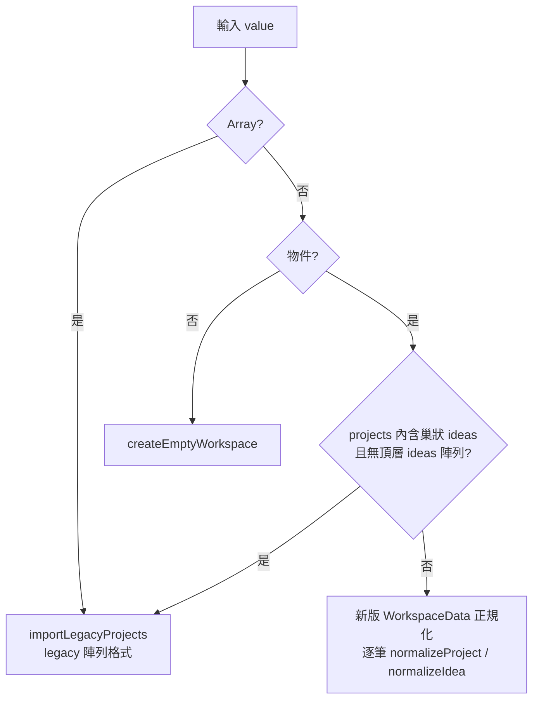

# data-structure.md — 資料結構（相容匯出資料）

> 適用於 **Ophan 點子追蹤器** 全新設計（greenfield）。
> 所有「事實性數值」對齊現有實作來源：
> [`packages/core/src/index.ts`](../packages/core/src/index.ts)、[`packages/storage/src/index.ts`](../packages/storage/src/index.ts)、[`apps/web/src/app.css`](../apps/web/src/app.css)。
> 本文件是資料相容性的硬地基：新設計的 Web 與 Desktop 共用同一份領域核心與序列化格式，只替換儲存 adapter。

---

## ① 概觀與設計目標

Ophan 的資料模型遵循三項原則：

| 原則 | 說明 |
| --- | --- |
| **穩定序列化（Stable serialization）** | 序列化的標準型別永遠是 `WorkspaceData`（`schemaVersion: 1`）。匯出 = `JSON.stringify(normalizeWorkspace(data), null, 2)`，匯入 = `normalizeWorkspace(JSON.parse(json))`。匯出/匯入必須能 round-trip（見 §⑩）。 |
| **向前相容（Additive / forward-compatible）** | 新欄位一律「可選 + 有預設值」。`normalizeWorkspace` 對缺漏欄位回填預設，對未知欄位忽略（不報錯）。舊版讀到新資料時，未知欄位被丟棄但核心欄位仍可運作。 |
| **schemaVersion 治理** | `schemaVersion` 是唯一的相容性閘門。目前固定為 `1`（`WORKSPACE_SCHEMA_VERSION = 1 as const`）。只有「破壞性的結構變更」才 bump（見 §⑨）；新增可選欄位 **不** bump。 |

設計目標明確排除過度設計：**單一本機資料源，不採用 CQRS / Event Sourcing**。資料是單一可變的 `WorkspaceData` 快照，所有 UseCase 都是 `(workspace, input) => newWorkspace` 的純函式（不可變更新）。

### 給不熟者：為什麼用「扁平陣列 + 純函式」

- `ideas` 是**扁平陣列**（不是巢狀在 project 底下），用 `idea.projectId` 關聯。扁平結構讓查詢、排序、軟刪除、round-trip 都更單純，也直接對應 SQLite 的關聯表（§⑧）。
- 領域核心 `packages/core` **不依賴** DOM / IndexedDB / SQLite / Svelte / Tauri，是純 TypeScript。這是六角架構（Ports & Adapters）的核心：核心定義 `ProjectRepository` 介面（port），各平台提供 adapter。
- 官方概念入門：
  - TypeScript 介面與型別 — <https://www.typescriptlang.org/docs/handbook/2/everyday-types.html>
  - 六角架構（Hexagonal / Ports & Adapters）概念 — <https://alistair.cockburn.us/hexagonal-architecture/>

---

## ② 核心實體欄位表

以下三表 1:1 對齊 `packages/core/src/index.ts` 的 `interface` 定義與 `normalize*` 預設值。

### `Project`

| 欄位 | 型別 | 選填 | 預設值 | 說明 | 不變量 |
| --- | --- | --- | --- | --- | --- |
| `id` | `string` | 否 | `createId()` | 專案唯一識別碼 | 全集合唯一；缺漏時自動生成 |
| `name` | `string` | 否 | `"Untitled project"` | 專案名稱 | `trim()` 後若為空字串則回退預設 |
| `description` | `string` | 否 | `""` | 描述 | 永遠是字串（非 null），`trim()` |
| `category` | `"CI" \| "MP" \| "SP" \| null` | 是 | `null` | 分類 | 非合法值一律正規化為 `null`（不分類） |
| `startDate` | `string \| null` | 是 | `null` | 起始日 `YYYY-MM-DD` | 空字串正規化為 `null` |
| `dueDate` | `string \| null` | 是 | `null` | 截止日 `YYYY-MM-DD` | 空字串正規化為 `null` |
| `pinned` | `boolean` | 否 | `false` | 是否釘選 | 只有 `=== true` 才視為 true |
| `order` | `number` | 否 | 索引值 `index` | 排序權重 | 新增時取尾端 `getVisibleProjects().length` |
| `createdAt` | `string` | 否 | `nowIso()` | 建立時間 ISO 8601 | 不可變 |
| `updatedAt` | `string` | 否 | `createdAt` | 最後更新 ISO 8601 | 任何 mutation 都會更新 |
| `deletedAt` | `string \| null` | 是 | `null` | 軟刪除時間戳 | `null` = 存活；非 null = 已刪除 |

### `Idea`

| 欄位 | 型別 | 選填 | 預設值 | 說明 | 不變量 |
| --- | --- | --- | --- | --- | --- |
| `id` | `string` | 否 | `createId()` | idea 唯一識別碼 | 全集合唯一 |
| `projectId` | `string` | 否 | 所屬 project `id` | 關聯到 `Project.id` | 攤平 legacy 巢狀時由父 project 補上 |
| `text` | `string` | 否 | `"Untitled idea"` | 內容文字 | `trim()` 後若為空則回退預設 |
| `done` | `boolean` | 否 | `false` | 是否完成 | 只有 `=== true` 才視為 true |
| `pinned` | `boolean` | 否 | `false` | 是否釘選 | 同上 |
| `order` | `number` | 否 | 索引值 `index` | 排序權重 | 新增時取尾端 `getIdeasForProject().length` |
| `createdAt` | `string` | 否 | `nowIso()` | 建立時間 ISO 8601 | 支援毫秒 number → ISO 轉換 |
| `updatedAt` | `string` | 否 | `finishedAt \|\| createdAt` | 最後更新 ISO 8601 | mutation 時更新 |
| `finishedAt` | `string \| null` | 是 | `null` | 完成時間 ISO 8601 | 與 `done` 連動（見 §④） |
| `deletedAt` | `string \| null` | 是 | `null` | 軟刪除時間戳 | `null` = 存活 |

### `WorkspaceData`

| 欄位 | 型別 | 選填 | 預設值 | 說明 |
| --- | --- | --- | --- | --- |
| `schemaVersion` | `1`（字面型別） | 否 | `1` | 結構版本；目前恆為 `1` |
| `projects` | `Project[]` | 否 | `[]` | 專案陣列（含已軟刪除者） |
| `ideas` | `Idea[]` | 否 | `[]` | **扁平** idea 陣列（非巢狀），用 `projectId` 關聯 |
| `meta` | `{ appName, updatedAt, deviceId }` | 否 | 見下 | 中介資料 |
| `meta.appName` | `"ophan"`（字面型別） | 否 | `"ophan"` | 固定值 |
| `meta.updatedAt` | `string` | 否 | `nowIso()` | workspace 最後寫入時間 |
| `meta.deviceId` | `string` | 否 | `createId()` | 來源裝置識別碼 |

> 注意：`projects` 與 `ideas` **保留**已軟刪除（`deletedAt != null`）的項目，以利跨裝置/匯入時保留刪除事實。UI 顯示用 `getVisibleProjects()` / `getIdeasForProject()` 過濾掉 `deletedAt`。

---

## ③ 列舉（Enumerations）

| 列舉 | 值 | 來源 / 說明 |
| --- | --- | --- |
| `ProjectCategory` | `"CI"` \| `"MP"` \| `"SP"` \| `null` | 專案分類；`null` 代表未分類。`VALID_CATEGORIES = {CI, MP, SP}`，`normalizeCategory` 會 `toUpperCase()` 後比對，非法值 → `null`。 |
| `IdeaFilter` | `"todo"` \| `"done"` \| `"all"` | idea 列表的檢視 tab。`done` 過濾 `idea.done === true`，`todo` 過濾 `false`，`all` 不過濾。 |
| `ProjectCategoryFilter` | `"CI"` \| `"MP"` \| `"SP"` \| `"NA"` | UI 的分類篩選 chip。**`NA` 代表 `category === null`（未分類）**。注意：這是 UI 篩選用列舉，不是儲存欄位；持久化於 `ophan.ui.categoryFilters`。 |
| `Theme` | `"light"` \| `"dark"` | 主題；持久化於 `ophan.theme`。 |
| `Locale` | `"en"` \| `"zh-TW"` | 語系；持久化於 `ophan.locale`。 |

> `ProjectCategory`（資料層，含 `null`）與 `ProjectCategoryFilter`（UI 層，含 `"NA"`）的對應：篩選比對時 `NA ⇄ null`，其餘原樣比對。

---

## ④ 欄位語意（Field semantics）

### ID 生成 — `createId()`

```ts
export const createId = () => {
  if (typeof crypto !== "undefined" && typeof crypto.randomUUID === "function") {
    return crypto.randomUUID();
  }
  return `id_${Date.now()}_${Math.random().toString(16).slice(2)}`;
};
```

- 優先使用 `crypto.randomUUID()`（標準 UUID v4）。
- 無 `crypto` 時 fallback 為 `id_${Date.now()}_${random16}`，例如 `id_1718500000000_9f2c1a...`。
- ID 是不透明字串，**不應**從其格式推導任何語意。

### 時間戳 — ISO 8601

- 所有 `*At` 欄位都是 `new Date().toISOString()`（UTC，例如 `2026-06-16T08:30:00.000Z`），由 `nowIso()` 產生。
- `toIsoTimestamp(value, fallback)` 接受 **number（毫秒）或 string**，兩者皆轉成 ISO；不可解析時回退 `fallback`。這是 legacy 毫秒時間戳相容的關鍵（見 §⑦）。

### 日期欄位 — `YYYY-MM-DD`

- `startDate` / `dueDate` 是純日期字串 `YYYY-MM-DD`，**不含時間**。
- 由 `asNullableString` 正規化：`trim()` 後空字串 → `null`。

### 排序語意 — `sortWorkItems`

排序鍵依序為 **pinned 優先 → order 升冪 → updatedAt localeCompare**：

```ts
export const sortWorkItems = (items) =>
  [...items].sort((a, b) => {
    if (a.pinned !== b.pinned) return a.pinned ? -1 : 1;   // 1. pinned 浮頂
    if (a.order !== b.order) return a.order - b.order;       // 2. order 升冪
    return a.updatedAt.localeCompare(b.updatedAt);           // 3. updatedAt 字典序
  });
```

Project 與 Idea 共用同一套排序語意（皆有 `pinned` / `order` / `updatedAt`）。

### 軟刪除 — `deletedAt`

- 刪除 = 設定 `deletedAt = nowIso()`（同時更新 `updatedAt`），**不**從陣列移除。
- 刪除 project 會**連動軟刪除**其底下所有 idea（`deleteProject` 內同時 patch ideas）。
- 可視函式（`getVisibleProjects` / `getIdeasForProject`）一律過濾 `deletedAt`。

### `finishedAt` 規則（與 `done` 連動）

`toggleIdeaDone` 的行為：

| 轉換 | `done` | `finishedAt` |
| --- | --- | --- |
| `false → true` | `true` | 設為 `nowIso()`（完成時間） |
| `true → false` | `false` | 設回 `null` |

完成紀錄 log（`getCompletionLog`）只列出 `!deletedAt && done && finishedAt` 的 idea，並依 `finishedAt` 由新到舊排序。

---

## ⑤ 匯出 JSON 標準格式

匯出由 `exportWorkspaceJson(workspace)` 產生：先 `normalizeWorkspace` 再 `JSON.stringify(…, null, 2)`（2 空格縮排）。標準範例如下，可直接作為測試 fixture：

```json
{
  "schemaVersion": 1,
  "projects": [
    {
      "id": "8f2c0e8a-7c2b-4f3a-9c11-2c4d6e8f0a12",
      "name": "Ophan 桌面殼",
      "description": "Tauri 2 殼層與 SQLite adapter",
      "category": "SP",
      "startDate": "2026-06-01",
      "dueDate": "2026-08-31",
      "pinned": true,
      "order": 0,
      "createdAt": "2026-06-01T02:00:00.000Z",
      "updatedAt": "2026-06-16T08:30:00.000Z",
      "deletedAt": null
    }
  ],
  "ideas": [
    {
      "id": "1a2b3c4d-5e6f-4a7b-8c9d-0e1f2a3b4c5d",
      "projectId": "8f2c0e8a-7c2b-4f3a-9c11-2c4d6e8f0a12",
      "text": "用 @tauri-apps/plugin-sql 完成 SqliteRepository",
      "done": true,
      "pinned": false,
      "order": 0,
      "createdAt": "2026-06-02T03:10:00.000Z",
      "updatedAt": "2026-06-10T09:00:00.000Z",
      "finishedAt": "2026-06-10T09:00:00.000Z",
      "deletedAt": null
    },
    {
      "id": "9z8y7x6w-5v4u-4t3s-2r1q-0p9o8n7m6l5k",
      "projectId": "8f2c0e8a-7c2b-4f3a-9c11-2c4d6e8f0a12",
      "text": "規劃 IndexedDbRepository 的版本升級流程",
      "done": false,
      "pinned": false,
      "order": 1,
      "createdAt": "2026-06-03T04:20:00.000Z",
      "updatedAt": "2026-06-03T04:20:00.000Z",
      "finishedAt": null,
      "deletedAt": null
    }
  ],
  "meta": {
    "appName": "ophan",
    "updatedAt": "2026-06-16T08:30:00.000Z",
    "deviceId": "device-3f1c9b2a"
  }
}
```

---

## ⑥ 匯入正規化（`normalizeWorkspace`）

匯入的單一入口是 `importWorkspaceJson(json, deviceId)` → `normalizeWorkspace(JSON.parse(json), deviceId)`。`normalizeWorkspace` 自動偵測輸入形狀並分派：



### 缺欄位回填預設值對照表

| 來源狀態 | 回填行為 |
| --- | --- |
| `id` 缺漏 | `createId()` |
| `name` / `text` 缺漏或空白 | `"Untitled project"` / `"Untitled idea"` |
| `description` 缺漏 | `""`（`trim`） |
| `category` 非法 | `null` |
| `startDate` / `dueDate` 空字串 | `null` |
| `pinned` / `done` 缺漏 | `false`（只有 `=== true` 才 true） |
| `order` 缺漏或非數字 | 陣列**索引值**（依輸入順序） |
| `createdAt` 缺漏 | `fallbackDate = nowIso()` |
| `createdAt` 為毫秒 number | `toIsoTimestamp` 轉 ISO |
| `updatedAt` 缺漏 | project → `createdAt`；idea → `finishedAt || createdAt` |
| `finishedAt` falsy | `null`；truthy → `toIsoTimestamp(…, createdAt)` |
| `deletedAt` 空字串 | `null` |
| idea `projectId` 缺漏 | 巢狀來源 → 父 project `id`；新版來源 → `projects[0]?.id || ""` |
| `meta` 缺漏 | `{ appName: "ophan", updatedAt: fallbackDate, deviceId }` |
| `meta.deviceId` 缺漏 | 呼叫端傳入的 `deviceId` |

> 正規化是**冪等**的：對已正規化的 `WorkspaceData` 再跑一次 `normalizeWorkspace`，結果等價（這是 §⑩ round-trip 的基礎）。

---

## ⑦ Legacy 相容（Project Idea Studio）

舊版（`lagcy/`）資料須能無痛匯入。涉及三種來源形狀與三類欄位轉換。

### Legacy 來源形狀

| 形狀 | 判定 | 處理 |
| --- | --- | --- |
| **陣列格式** | 頂層是 `Array`（一組 legacy project） | `importLegacyProjects` |
| **物件格式（巢狀）** | 物件且 `projects[]` 內含 `ideas` 且**無**頂層 `ideas` | 取 `value.projects` 走 `importLegacyProjects` |
| **新版格式** | 物件且有頂層扁平 `ideas` | 一般正規化路徑 |

### `lz:` 壓縮 payload

Legacy LocalStorage（key `project-idea-collection.v1`）的值可能被壓縮：

- 若字串以前綴 **`lz:`** 開頭，去除前綴後用 **`lz-string` 的 `decompressFromUTF16`** 解壓，得到 JSON 文字再交給 `importWorkspaceJson`。
- 無前綴則視為純 JSON。
- 解壓失敗（回傳 falsy）時丟出錯誤 `"Legacy data is compressed but could not be decoded."`。

來源：`packages/storage/src/index.ts` 的 `LocalStorageLegacyImporter`（`LEGACY_COMPRESSED_PREFIX = "lz:"`）。

### 欄位映射（舊 → 新）

Legacy `Project`：`{ id, name, description, startDate, dueDate, category, pinned, ideas: [...] }`（**巢狀**）
Legacy `Idea`：`{ id, text, done, createdAt(毫秒 number), finishedAt, pinned }`

| Legacy 欄位 | 新欄位 | 轉換 |
| --- | --- | --- |
| `project.id` | `Project.id` | 原樣（缺則 `createId()`） |
| `project.name/description/category/startDate/dueDate/pinned` | 同名 | 經 §⑥ 預設回填 |
| — | `Project.order` | 依陣列索引補上 |
| — | `Project.createdAt/updatedAt` | 缺則 `nowIso()` |
| — | `Project.deletedAt` | `null` |
| `project.ideas[]` | 攤平進頂層 `WorkspaceData.ideas` | 每筆補 `projectId = project.id` |
| `idea.createdAt`（毫秒 number） | `Idea.createdAt`（ISO） | `toIsoTimestamp` ms → ISO |
| `idea.finishedAt` | `Idea.finishedAt` | truthy → ISO；falsy → `null` |
| `idea.done/pinned/text` | 同名 | 預設回填 |
| — | `Idea.order` | 依索引 |
| — | `Idea.updatedAt` | `finishedAt || createdAt` |
| — | `Idea.deletedAt` | `null` |

> 巢狀 → 扁平：`importLegacyProjects` 遍歷每個 legacy project，先 `normalizeProject`，再把 `project.ideas` 逐筆 `normalizeIdea(legacyIdea, project.id, ideaIndex, fallbackDate)` 推入扁平 `ideas`。

### Legacy 主題 / UI key

| Legacy key | 用途 | 對應新版 key |
| --- | --- | --- |
| `project-idea-collection.v1` | 資料 | （匯入後寫入 IndexedDB） |
| `project-idea-collection.theme` | 主題偏好 | `ophan.theme` |
| `project-idea-collection.ui` | UI 狀態 | `ophan.ui` |

---

## ⑧ 儲存層映射

領域核心透過 `ProjectRepository` 介面（port）存取資料；各平台提供 adapter。

```ts
interface ProjectRepository {
  loadWorkspace(): Promise<WorkspaceData>;
  saveWorkspace(data: WorkspaceData): Promise<void>;
  exportWorkspace(data: WorkspaceData): string;
  importWorkspace(json: string): Promise<WorkspaceData>;
}
```

### Web — IndexedDB（`IndexedDbRepository`）

| 參數 | 值 |
| --- | --- |
| DB 名稱 | `"ophan"` |
| Object store | `"workspace"` |
| Key | `"current"` |
| 值 | 序列化後的 `WorkspaceData`（結構化複製，非字串） |
| DB 版本 | `1`（`onupgradeneeded` 建立 store） |

讀寫前都會跑 `normalizeWorkspace(…, deviceId)`，確保存入/取出的資料一致。無 IndexedDB（如 SSR）時回退 `createEmptyWorkspace`。

### Desktop — SQLite（`SqliteRepository`，`@tauri-apps/plugin-sql` 2.4.0）

SQLite schema 採 **projects / ideas / meta 三表**，須能 **1:1 round-trip 回 `WorkspaceData` JSON**。布林以 `INTEGER`（0/1）儲存，nullable 欄位用 `NULL`。

```sql
-- projects：對應 WorkspaceData.projects
CREATE TABLE IF NOT EXISTS projects (
  id          TEXT    PRIMARY KEY,
  name        TEXT    NOT NULL DEFAULT 'Untitled project',
  description TEXT    NOT NULL DEFAULT '',
  category    TEXT,                 -- 'CI' | 'MP' | 'SP' | NULL；建議 CHECK
  start_date  TEXT,                 -- YYYY-MM-DD | NULL
  due_date    TEXT,                 -- YYYY-MM-DD | NULL
  pinned      INTEGER NOT NULL DEFAULT 0,  -- 0 | 1
  "order"     INTEGER NOT NULL DEFAULT 0,
  created_at  TEXT    NOT NULL,     -- ISO 8601
  updated_at  TEXT    NOT NULL,     -- ISO 8601
  deleted_at  TEXT,                 -- ISO 8601 | NULL
  CHECK (category IN ('CI','MP','SP') OR category IS NULL)
);

-- ideas：對應 WorkspaceData.ideas（扁平，FK 指向 projects）
CREATE TABLE IF NOT EXISTS ideas (
  id          TEXT    PRIMARY KEY,
  project_id  TEXT    NOT NULL REFERENCES projects(id) ON DELETE CASCADE,
  text        TEXT    NOT NULL DEFAULT 'Untitled idea',
  done        INTEGER NOT NULL DEFAULT 0,  -- 0 | 1
  pinned      INTEGER NOT NULL DEFAULT 0,  -- 0 | 1
  "order"     INTEGER NOT NULL DEFAULT 0,
  created_at  TEXT    NOT NULL,
  updated_at  TEXT    NOT NULL,
  finished_at TEXT,                 -- ISO 8601 | NULL
  deleted_at  TEXT                  -- ISO 8601 | NULL
);
CREATE INDEX IF NOT EXISTS idx_ideas_project ON ideas(project_id);

-- meta：對應 WorkspaceData.meta（單列，schemaVersion 一併存放）
CREATE TABLE IF NOT EXISTS meta (
  id              INTEGER PRIMARY KEY CHECK (id = 1),  -- 永遠單列
  schema_version  INTEGER NOT NULL DEFAULT 1,
  app_name        TEXT    NOT NULL DEFAULT 'ophan',
  updated_at      TEXT    NOT NULL,
  device_id       TEXT    NOT NULL
);
```

**Round-trip 約定**：

- `INTEGER 0/1 ⇄ boolean false/true`。
- SQL `NULL ⇄ JSON null`。
- `"order"` 為 SQLite 保留字，須加雙引號。
- 讀出後組裝成 `WorkspaceData` 再跑一次 `normalizeWorkspace`，即可保證與 Web 匯出等價。
- `ON DELETE CASCADE` 僅針對硬刪除；Ophan 用**軟刪除**（設 `deleted_at`），平時不觸發 CASCADE。

> **給不熟者：** `@tauri-apps/plugin-sql` 讓前端 TS 直接以 `Database.load("sqlite:ophan.db")` 後 `db.execute(sql, params)` / `db.select(sql)` 操作 SQLite，無須寫 Rust。Rust 端僅在 `tauri.conf.json` 註冊 plugin。官方文件：<https://v2.tauri.app/plugin/sql/>。SQLite 型別親和性：<https://www.sqlite.org/datatype3.html>。

### localStorage keys

| Key | 內容 | 型別 |
| --- | --- | --- |
| `ophan.device-id` | 裝置識別碼（= `meta.deviceId` 來源） | `string` |
| `ophan.theme` | 主題 | `"light" \| "dark"` |
| `ophan.ui` | UI 狀態（見下） | JSON 物件 |
| `ophan.locale` | 語系 | `"en" \| "zh-TW"` |

`ophan.ui` 結構：

```json
{ "railCollapsed": false, "logCollapsed": true, "categoryFilters": [] }
```

| 欄位 | 型別 | 預設 | 說明 |
| --- | --- | --- | --- |
| `railCollapsed` | `boolean` | `false` | 左側 ProjectRail 是否收合 |
| `logCollapsed` | `boolean` | `true` | 右側 CompletionPanel 預設收合 |
| `categoryFilters` | `ProjectCategoryFilter[]` | `[]` | 啟用的分類 chip（`"CI"`/`"MP"`/`"SP"`/`"NA"`） |

> Desktop 端的 UI 偏好可改用 `@tauri-apps/plugin-store`（2.4.3）持久化，但 key 與結構維持相同語意。

---

## ⑨ Schema 版本與遷移

### bump 規則

| 變更類型 | 是否 bump `schemaVersion` |
| --- | --- |
| 新增**可選**欄位（有預設） | **否**（additive，向前相容） |
| 移除欄位 / 改型別 / 改語意 | **是**（破壞性） |
| 改變實體關聯（如 ideas 改回巢狀） | **是** |

### migration 函式契約

遷移採「逐版鏈式」純函式，集中於 core：

```ts
type Migration = (data: unknown) => WorkspaceData;

// 由 from 版升到 from+1 版；只處理單一階躍
const migrations: Record<number, Migration> = {
  // 1: (data) => migrateV1toV2(data),   // 未來
};

export const migrateWorkspace = (raw: unknown): WorkspaceData => {
  let data = raw as { schemaVersion?: number };
  let v = typeof data?.schemaVersion === "number" ? data.schemaVersion : 1;
  while (v < WORKSPACE_SCHEMA_VERSION && migrations[v]) {
    data = migrations[v](data) as typeof data;
    v += 1;
  }
  return normalizeWorkspace(data);   // 最後恆過正規化
};
```

契約：

1. 每個 migration 只負責 `n → n+1` 單一階躍，輸入/輸出皆為完整 workspace。
2. migration 為純函式、無副作用、冪等。
3. 鏈尾**必定**呼叫 `normalizeWorkspace`（補預設、攤平、回填）。
4. **向前相容原則**：低於目前 `schemaVersion` 的舊資料一律可升級；遇到**高於**目前版本的未知 `schemaVersion`，採「盡力解析」— 仍跑 `normalizeWorkspace`，未知欄位被忽略而非報錯。

---

## ⑩ 相容性測試（Round-trip 驗收）

相容性以可執行測試（建議 `vitest` 4.1.9）固定，作為驗收門檻。

### R1 — 新版 round-trip（冪等）

```
normalizeWorkspace(JSON.parse(exportWorkspaceJson(ws))) ≡ normalizeWorkspace(ws)
```

匯出再匯入，所有欄位（含 `id` / 時間戳 / `order` / `deletedAt`）逐欄相等。

### R2 — Legacy 匯入 → 匯出 → 再匯入應等價

```
A = importWorkspaceJson(legacyJson)        // legacy 陣列或巢狀物件
B = importWorkspaceJson(exportWorkspaceJson(A))
assert deepEqual(A, B)                       // A、B 完全等價
```

驗證重點：

- 巢狀 `project.ideas` 已攤平為頂層扁平 `ideas`，且每筆 `projectId` 正確指回父 project。
- legacy 毫秒 `createdAt` 已轉 ISO；轉一次後再匯入不再改變（穩定）。
- 缺漏的 `order` / `updatedAt` / `deletedAt` 已回填且第二次匯入維持不變。

### R3 — `lz:` 壓縮 payload

```
raw = "lz:" + compressToUTF16(JSON.stringify(legacy))
decoded = LocalStorageLegacyImporter.loadLegacyWorkspace()   // 解壓 → 正規化
assert decoded ≡ importWorkspaceJson(JSON.stringify(legacy))
```

壓縮與未壓縮兩條路徑須得到等價結果。

### R4 — SQLite 1:1 round-trip（Desktop）

```
ws  →  寫入 projects/ideas/meta 三表  →  讀回組裝  →  normalizeWorkspace
```

讀回結果須與原 `WorkspaceData` 逐欄相等（含 boolean ⇄ 0/1、null ⇄ NULL）。

### 驗收清單

- [ ] R1 新版 round-trip 通過（冪等）。
- [ ] R2 legacy（陣列 + 巢狀物件）匯入 → 匯出 → 再匯入等價。
- [ ] R3 `lz:` 壓縮與未壓縮等價。
- [ ] R4 SQLite 三表 1:1 round-trip 通過。
- [ ] 非法 `category` / 空白 `name`/`text` / falsy `finishedAt` 全部正規化到預設。
- [ ] 高於目前 `schemaVersion` 的資料不報錯（盡力解析）。

---

### 參考來源（與實作對得上）

- 型別、列舉、`normalize*`、排序、UseCase：[`packages/core/src/index.ts`](../packages/core/src/index.ts)
- IndexedDB adapter、legacy `lz:` 解壓：[`packages/storage/src/index.ts`](../packages/storage/src/index.ts)
- Design tokens / 版面：[`apps/web/src/app.css`](../apps/web/src/app.css)
- 規格背景：[`doc/spec.md`](./spec.md)
