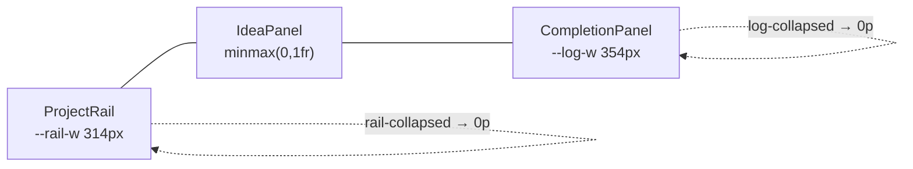

# design.md — Ophan 設計系統

> 對標 Material 3 / IBM Carbon / Shopify Polaris 的單一事實來源（single source of truth）。
> 本文件描述 Ophan 點子追蹤器【全新設計】的視覺與互動語言。所有「事實性數值」（色碼、字級、間距、動效）皆與 `apps/web/src/app.css` 一一對應，可直接拿來實作。
>
> **語言慣例**：說明文字使用繁體中文，技術名詞、CSS token、識別字保留原文。
> **適用範圍**：`packages/ui`（共用 Svelte 5 元件庫 + design tokens）、`apps/web`、`apps/desktop` 共用同一份 token 與元件。

---

## 目錄

1. [設計原則 Principles](#1-設計原則-principles)
2. [色彩 Color](#2-色彩-color)
3. [字體排印 Typography](#3-字體排印-typography)
4. [間距與佈局 Spacing & Layout](#4-間距與佈局-spacing--layout)
5. [高度與陰影 Elevation](#5-高度與陰影-elevation)
6. [動效 Motion](#6-動效-motion)
7. [載入狀態 Loading / Skeleton](#7-載入狀態-loading--skeleton)
8. [圖示 Iconography](#8-圖示-iconography)
9. [元件 Components](#9-元件-components)
10. [模式 Patterns](#10-模式-patterns)
11. [可存取性 Accessibility](#11-可存取性-accessibility)
12. [主題擴充指南 Theming](#12-主題擴充指南-theming)

---

## 1. 設計原則 Principles

Ophan 是一個「工具型」應用，使用者長時間停留、密集操作。設計語言因此選擇高密度、低噪音、層次清晰的方向。對標各大設計系統的對應理念如下：

| Ophan 原則 | 說明 | 對標參照 |
| --- | --- | --- |
| **簡潔優先 Calm by default** | 介面留白克制、不裝飾性元素；色彩只在「需要被看見的地方」出現（accent 用於進度、active、focus）。 | Polaris「Build for everyone, reduce cognitive load」 |
| **工具型密度 Functional density** | 正文 14px、面板/idea 13.5px、小字下探到 9.5px。在不犧牲可讀性的前提下，單一視窗放下三欄工作區。 | Carbon「Productivity-first, data-dense」 |
| **層次優於陰影 Layering over shadow** | 主要用三層 surface（`--surface` / `--surface-2` / `--surface-3`）+ 1px border + 漸層描邊建立層次，陰影只保留一條 `--shadow-pop` 給「浮起」元素（dialog / toast）。 | 與 Material 3 的 tonal elevation 同向，但更克制 |
| **動效有目的 Purposeful motion** | 動效只服務三件事：建立空間關係（進場 stagger）、回饋操作（active 壓縮）、表達狀態變化（進度條、flip 重排）。無裝飾性動畫，且全面尊重 `prefers-reduced-motion`。 | Material 3 Motion「Motion provides meaning」 |

**設計準則白話版（給快速上手的人）**

- 想加陰影前，先問：能不能用 `--surface-2` / `--surface-3` 換層次解決？
- 想加顏色前，先問：這是不是 accent 該出現的語意位置（進度 / active / focus / pin）？
- 想加動畫前，先問：它表達了哪一個狀態變化？若答不出來，就不要加。

---

## 2. 色彩 Color

色彩系統以 CSS Custom Properties 定義於 `:root`（light）與 `:root[data-theme="dark"]`（dark），來源檔案：`apps/web/src/app.css`。切換主題只需改變 `document.documentElement.dataset.theme`，不重載樣式。

### 2.1 完整 Token 表（light / dark）

| Token | Light 值 | Dark 值 | 用途 |
| --- | --- | --- | --- |
| `--bg` | `#f6f6f1` | `#0b1116` | body 底色（漸層起點） |
| `--bg-soft` | `#f9efe4` | `#141f28` | body 漸層終點，營造暖色暈染 |
| `--surface` | `#ffffff` | `#161f27` | 第一層卡片 / 面板 / dialog 底 |
| `--surface-2` | `#f1f4f0` | `#1b2630` | 第二層：card / idea / log 預設底、input 底 |
| `--surface-3` | `color-mix(in srgb, var(--accent) 6%, var(--surface-2))` | `color-mix(in srgb, var(--accent) 6%, var(--surface-2))` | 第三層：card / idea / log hover 底（帶極淡 accent） |
| `--ink` | `#0d1b2a` | `#f4f6f9` | 主要文字 |
| `--muted` | `#5b6473` | `#b1bcc7` | 次要文字、時間戳、metadata |
| `--accent` | `#1f8a70` | `#33c1a0` | 主品牌綠：進度條、focus、漸層起點 |
| `--accent-ink` | `#176b56` | `#66dfc4` | accent 文字態（圖示、強調字、panel-count） |
| `--accent-2` | `#e9b44c` | `#f0c56d` | 次強調金：漸層終點、pin、category badge |
| `--accent-2-ink` | `#705018` | `#f0c56d` | accent-2 文字態（pin 圖示、category 文字） |
| `--accent-soft` | `color-mix(in srgb, var(--accent) 10%, var(--surface))` | `color-mix(in srgb, var(--accent) 14%, var(--surface))` | accent 極淡填色：brand-mark 底、hover 高亮底 |
| `--accent-border` | `color-mix(in srgb, var(--accent) 42%, var(--border))` | `color-mix(in srgb, var(--accent) 48%, var(--border))` | accent hover 邊框 |
| `--primary-bg` | `#176b56` | `var(--accent)` | 主按鈕底 |
| `--primary-fg` | `#ffffff` | `#0d1b2a` | 主按鈕文字 |
| `--active-bg` | `#176b56` | `var(--accent)` | active 態底（segmented、chip、tool-button） |
| `--active-fg` | `#ffffff` | `#0d1b2a` | active 態文字 |
| `--danger` | `#d1495b` | `#e06c7c` | 刪除 / 危險操作 |
| `--border` | `rgba(13,27,42,0.1)` | `rgba(244,246,249,0.1)` | 標準 1px 邊框 |
| `--border-strong` | `rgba(13,27,42,0.18)` | `rgba(244,246,249,0.2)` | 強化邊框（divider、empty-state 虛線） |
| `--note` | `rgba(255,255,255,0.72)` | `rgba(15,22,28,0.75)` | Topbar 毛玻璃半透明底 |
| `--glow-1` | `#fffdf7` | `#121a22` | body radial-gradient 暈光（左上） |
| `--glow-2` | `#e8f3ee` | `#0c171f` | body radial-gradient 暈光（右上） |
| `--dot` | `rgba(13,27,42,0.06)` | `rgba(244,246,249,0.05)` | 點狀紋理（保留用） |
| `--shadow-pop` | `0 8px 24px rgba(13,27,42,0.12)` | `0 8px 24px rgba(4,8,12,0.5)` | 浮起元素唯一陰影（dialog / toast） |

> **註**：dark 模式刻意讓 `--accent-2-ink === --accent-2`（皆 `#f0c56d`），因為深底上金色本身對比已足夠，不需再壓深。

### 2.2 語意色（semantic roles）

| 角色 | 使用的 token | 出現位置 |
| --- | --- | --- |
| Primary action | `--primary-bg` / `--primary-fg` | `.primary` 主按鈕 |
| Active / selected | `--active-bg` / `--active-fg` | segmented tab、chip、tool-button `[aria-pressed="true"]` |
| Accent / focus | `--accent`、`--accent-ink` | 進度條、focus ring、圖示、panel-count |
| Pin / highlight | `--accent-2`、`--accent-2-ink` | pin 圖示、category badge |
| Danger | `--danger` | 刪除按鈕、危險確認 dialog |
| Muted | `--muted` | metadata、時間戳、placeholder 文字 |

> Ophan **不另設** success / warning / info 三色，避免色彩噪音。完成狀態以 accent 漸層 + 進度表達，錯誤狀態以 danger 表達，其餘以層次與文字傳達。

### 2.3 漸層 Gradients

```css
/* 進度條、強調分隔線：accent → accent-2 水平漸層 */
--grad-accent: linear-gradient(90deg, var(--accent), var(--accent-2));

/* 雙色描邊：用於 active card / active chip 的 border-box 技法 */
--grad-border: linear-gradient(
  135deg,
  color-mix(in srgb, var(--accent) 60%, transparent),
  color-mix(in srgb, var(--accent-2) 60%, transparent)
);
```

**雙色描邊技法（active 卡片的綠金邊）**：用兩層背景，內層填 surface（padding-box），外層填漸層（border-box），即可在不改變 border 寬度下做出漸層描邊：

```css
.project-card.active,
.chip.active {
  border-color: transparent;
  background:
    linear-gradient(var(--surface), var(--surface)) padding-box,
    var(--grad-border) border-box;
}
```

### 2.4 `color-mix` 用法

系統大量使用 `color-mix(in srgb, …)` 以「單一基底色 + 百分比」衍生半透明 / 混色，避免硬編一堆色碼。常見配方：

| 用途 | 配方 |
| --- | --- |
| accent 極淡填色 | `color-mix(in srgb, var(--accent) 10%, var(--surface))` |
| focus ring | `0 0 0 3px color-mix(in srgb, var(--accent) 18%, transparent)` |
| danger 按鈕底 | `color-mix(in srgb, var(--danger) 8%, var(--surface))` |
| 進度軌底 | `color-mix(in srgb, var(--ink) 9%, transparent)` |
| line-through 顏色 | `color-mix(in srgb, var(--ink) 35%, transparent)` |
| 卡片動作浮層底 | `color-mix(in srgb, var(--surface) 88%, transparent)` |
| scrollbar thumb | `color-mix(in srgb, var(--muted) 42%, transparent)` |

> **給不熟者**：`color-mix()` 是原生 CSS 函式，第一參數是色彩空間（這裡固定 `in srgb`），後面兩個是要混合的顏色與百分比。它能跟著 `--accent` 改變自動重算，是本系統「換一個 accent 就整套變色」的關鍵。參考：[MDN color-mix()](https://developer.mozilla.org/docs/Web/CSS/color_value/color-mix)。

### 2.5 三層 Surface 策略

層次靠 surface 疊加而非陰影。由低到高：

```
body 漸層底  →  --surface（面板/卡片第一層）
            →  --surface-2（卡片/idea/input 預設底）
            →  --surface-3（hover：surface-2 + 6% accent）
            →  浮起元素（dialog/toast）才用 --shadow-pop
```

實作對照：`.panel { background: var(--surface) }`、`.project-card { background: var(--surface-2) }`、`.project-card:hover { background: var(--surface-3) }`。

---

## 3. 字體排印 Typography

### 3.1 Font Stack

```css
--font-ui: "Chiron GoRound TC", "Noto Sans TC", "Microsoft JhengHei", sans-serif;
--font-display: var(--font-ui);  /* 標題同 UI 字 */
--font-mono: var(--font-ui);     /* 等寬語意，但實際同 UI 字（用於 metadata/數字） */
```

全系統共用單一字族。`--font-mono` 並非真等寬字，而是用於「數字 / 時間戳 / 標籤」這類需要視覺一致性的 metadata（透過字級與 letter-spacing 區分）。`body` 設定 `font-synthesis: none` 與 `text-rendering: optimizeLegibility`。

### 3.2 響應式 Type Scale（clamp）

標題使用 `clamp(min, 流體, max)` 達成跨裝置縮放，正文與小字使用固定 px。

| 角色 | font-size | line-height | weight | 出現位置 |
| --- | --- | --- | --- | --- |
| Hero（文件首屏） | `clamp(32px, 5vw, 58px)` | `1.02` | 650 | tech-docs hero `h3` |
| Section 標題 | `clamp(18px, 2vw, 24px)` | `1.18` | 650 | `.section-copy h4` |
| 焦點面板標題 | `clamp(20px, 2.4vw, 27px)` | `1.1` | 650 | `.focus-title h2`（專案名） |
| Dialog 標題 | `21px` | — | 650 | `.dialog-head h2` |
| 空狀態標語 | `20px` | — | display | `.empty-state p` |
| Brand 標題 | `18px` | `1.1` | display | `.brand-title` |
| 專案卡標題 | `15.5px` | — | (h3) | `.card-title-row h3` |
| 正文 | `14px` | `1.65` | 400 | hero/section 段落、specimen 正文 |
| Panel 標題 / idea 文字 | `13.5px` | — | 600 | `.panel-head-title`、`.idea-text` |
| 焦點描述 | `13px` | `1.5` | 400 | `.focus-desc` |
| 次要正文 / label 內文 | `12.5px` | `1.5` | — | `.project-desc`、`.segmented button` |
| 小字（mono/meta） | `12px` | — | — | `.mono`、`label`、`.panel-count` |
| 微標籤 | `11.5px` / `11px` | — | — | chip、focus-sub、log-meta |
| 極小標籤 | `10.5px` / `10px` / `9.5px` | — | — | idea-stamp、trend-label、rail chip |

> **行高慣例**：正文段落一律 `1.65`（hero/section/snapshot），描述文字 `1.5`–`1.55`，標題 `1.0`–`1.18`。`<h1,h2,h3>` 全域 `font-weight: 650; letter-spacing: 0`。

### 3.3 Weight 與 letter-spacing

| 用途 | weight | letter-spacing |
| --- | --- | --- |
| 標題 h1/h2/h3 | `650` | `0` |
| 正文 | `400` | 預設 |
| panel / idea / 強調字 | `600` | 預設 |
| 按鈕 chip 加粗 | `700`–`750` | — |
| mono 標籤（chip / focus-sub / category） | — | `0.04em`–`0.07em` + `uppercase` |

---

## 4. 間距與佈局 Spacing & Layout

### 4.1 Spacing Scale

系統未宣告 spacing 變數，而是以一組固定階梯複用（單位 px）。建議在 `packages/ui` 落地時集中為 token：

| 階 | 值 | 典型用途 |
| --- | --- | --- |
| 2xs | `4` | icon 間隙、card-actions gap |
| xs | `6` | label gap、chip-row gap、按鈕內 icon gap |
| sm | `8` | card gap、idea gap、dialog-actions gap |
| md | `10` / `11` | scroll-list gap、卡片內距 |
| base | `12` | panel-body gap、dialog gap |
| lg | `14` | app-shell gap、rail/log 內距、panel 內距 |
| xl | `16` | panel-head 內距、scroll padding |
| 2xl | `18` | focus-head 內距、section 內距 |
| 3xl | `20`–`22` | dialog padding、empty-state padding |

### 4.2 App-shell（100dvh，無外層捲動）

```css
#app { height: 100%; }

.app-shell {
  display: grid;
  grid-template-rows: auto minmax(0, 1fr);  /* topbar 自動高 + 工作區填滿 */
  gap: 14px;
  height: 100dvh;
  padding: 14px;
  overflow: hidden;       /* 外層不捲動，各欄獨立捲動 */
}

body { overflow: hidden; }  /* 桌面：整頁不捲動 */
```

`minmax(0, 1fr)` 是關鍵：沒有 `min` 為 0，grid 子項的 `overflow-y: auto` 會失效。每個面板用 `min-height: 0` + flex 內捲。

### 4.3 三欄工作區與收合動畫

```css
.workspace-grid {
  --rail-w: 314px;   /* 左：專案欄 */
  --log-w: 354px;    /* 右：完成紀錄欄 */
  display: grid;
  grid-template-columns: var(--rail-w) minmax(0, 1fr) var(--log-w);
  min-height: 0;
  transition: grid-template-columns 0.28s cubic-bezier(0.4, 0, 0.2, 1);
}

.workspace-grid.rail-collapsed { --rail-w: 0px; }
.workspace-grid.log-collapsed  { --log-w: 0px; }
```

- **收合**靠把欄寬變數設為 `0px`，並對 `grid-template-columns` 做 `0.28s` 過渡，達到平滑滑入/滑出。
- 收合時欄內容 `overflow: hidden`，內層固定 `width: 314px / 354px`（`.rail-inner` / `.log-inner`），避免寬度動畫期間文字回流。
- 右側 log 欄預設收合（`ophan.ui.logCollapsed: true`）。



### 4.4 Border-radius Scale

| 半徑 | 用途 |
| --- | --- |
| `999px` (pill) | chip、category-badge、segmented、progress-track、check-button(50%) |
| `18px` | tech-docs-dialog |
| `16px` | dialog、hero/section panel |
| `14px` | panel、idea-edit 按鈕、specimen 卡 |
| `13px` | principle-card、token-row、theme card |
| `12px` | topbar、empty-state、docs-snapshot 內格 |
| `11px` | toast、color-swatch |
| `10px` | project-card、idea-card、log-item、skeleton、tool-button(9px 變體) |
| `9px` | tool-button、按鈕、input、brand-mark |
| `8px` | action-btn |
| `6px` | skeleton `.line` |

### 4.5 Breakpoints

| 斷點 | 行為 |
| --- | --- |
| `> 900px` | 桌面：三欄、`body overflow: hidden`、100dvh 固定 |
| `≤ 900px`（平板） | 單欄堆疊：`grid-template-columns: 1fr`、`body overflow: auto`、`app-shell height: auto`、欄寬動畫關閉、收合改為 `display: none`、topbar 改直排 |
| `≤ 560px`（手機） | 縮 padding 至 `10px`、按鈕全寬、dialog 圓角降為 `14px` |
| `@media (hover: none)` | 觸控裝置：card-actions / log-reopen 永遠顯示（無 hover 可觸發） |
| `@media (prefers-reduced-motion)` | 見 [動效](#6-動效-motion) |

---

## 5. 高度與陰影 Elevation

Ophan 走「低陰影 / 重層次」路線。Elevation 由三件事構成，優先序由上到下：

1. **Surface 疊層**（主力）：`--surface` → `--surface-2` → `--surface-3`，見 §2.5。
2. **1px Border**：`--border`（標準）/ `--border-strong`（divider、虛線框）。
3. **唯一陰影 `--shadow-pop`**：只給真正「浮在內容之上」的元素。

| 層級 | 視覺手段 | 元件 |
| --- | --- | --- |
| Level 0（底） | body 漸層 | app 背景 |
| Level 1 | `--surface` + 1px border | panel、卡片容器 |
| Level 2 | `--surface-2` | card / idea / input |
| Level 2-hover | `--surface-3`（+6% accent） | card / idea / log hover |
| Level 3（浮起） | `--shadow-pop` | `dialog`、`.toast`、`.doc-toast` |

### Focus Ring（鍵盤可視）

```css
button:focus-visible {
  outline: 2px solid var(--accent);
  outline-offset: 2px;
}
input:focus, textarea:focus, select:focus {
  border-color: var(--accent);
  box-shadow: 0 0 0 3px color-mix(in srgb, var(--accent) 18%, transparent);
}
```

兩種 focus 表現：互動按鈕用 `outline`（不佔版面），表單欄位用 3px accent 18% 的 ring（柔和高亮）。

---

## 6. 動效 Motion

動效分兩條技術路線：**GSAP** 負責「首次進場」的編排（timeline / stagger），**Svelte 內建 transition/animate** 負責「列表變化」的微互動（flip / slide / fade），**CSS transition** 負責 hover / active / 收合。

### 6.1 Duration / Easing Token

| Token / 值 | Easing | 用途 |
| --- | --- | --- |
| `0.28s` | `cubic-bezier(0.4, 0, 0.2, 1)` | 欄收合（grid-template-columns） |
| `0.4s` | `cubic-bezier(0.22, 1, 0.36, 1)` | 進度條 width |
| `0.15s` | `ease` | hover：color / border / background |
| `0.18s` | `ease` | input border / box-shadow |
| `0.2s` | `ease` | idea-card opacity（done 切換） |
| `0.22s` | `cubic-bezier(0.22, 1, 0.36, 1)` | docs 導覽按鈕 hover |
| `0.45`（GSAP） | `power2.out` | 首次進場 timeline |

active 壓縮回饋（所有可點元素統一）：

```css
.primary:active, .ghost:active, .danger:active,
.tool-button:active, .action-btn:active, .chip:active,
.segmented button:active {
  transform: translateY(1px) scale(0.98);
}
```

### 6.2 GSAP 進場規格

首次掛載時用一條 GSAP timeline 編排三組 stagger，營造「由上而下、由淺入深」的空間感：

| 群組 | 起始位移 | stagger | 對應 |
| --- | --- | --- | --- |
| bars（topbar 列） | `y: -12` | `0.05` | topbar 元素 |
| panels（三欄面板） | `y: 16` | `0.08` | rail / focus / log |
| cards（卡片） | `y: 10` | `0.04` | project / idea / log 卡片 |

timeline 統一 `duration: 0.45, ease: "power2.out"`。

> **給不熟者（GSAP）**：GSAP 是業界標準的 JS 動畫庫，`timeline()` 讓多段動畫串接，`stagger` 讓一組元素依序錯開進場。在 Svelte 5 裡，於 `$effect` 或 `onMount` 取得 DOM 後建立 timeline，並在清理函式 `kill()` 它。官方文件：[gsap.com/docs](https://gsap.com/docs/v3/)。版本：`gsap 3.15.0`。

### 6.3 Svelte transition / animate

| 機制 | 時長 | 用途 |
| --- | --- | --- |
| `animate:flip` | `motionMs(240)` | 卡片重排（拖曳排序、pin 變動） |
| `transition:slide` | `motionMs(160)` | log 項目進出 |
| `transition:fade` | `motionMs(140)` | 卡片淡入淡出 |

`motionMs(n)` 是一個包裝器：當 `prefers-reduced-motion` 為真時回傳 `0`，否則回傳 `n`。所有 Svelte 動效都應經過它。

> **給不熟者（Svelte transition / FLIP）**：`transition:` 處理元素「進場/離場」，`animate:flip` 處理元素「在列表中位移」（FLIP 技術，自動算出舊新位置差做動畫）。兩者皆為 Svelte 內建。官方文件：[Svelte transitions](https://svelte.dev/docs/svelte/transition)、[animate:flip](https://svelte.dev/docs/svelte/svelte-animate)。

### 6.4 進度條與狀態動效

```css
.progress-fill {
  background: var(--grad-accent);
  transition: width 0.4s cubic-bezier(0.22, 1, 0.36, 1);
}
```

### 6.5 視差滾動準則（Parallax）

- 視差**只用於文件型 / 行銷型長頁**（例如技術文件首屏），**不用於工作區**——工作區需要精準、即時的操作回饋，視差會干擾。
- 位移幅度克制（背景比前景慢，建議差速 ≤ 30%），避免暈眩。
- 必須以 GSAP ScrollTrigger 或 IntersectionObserver 觸發，並包進 reduced-motion 判斷：reduced-motion 下停用視差，內容直接定位。
- 搭配延遲載入（lazy load）：重資源（如 ECharts ~509KB chunk）只在進入視窗或首次需要時動態 `import()`。

### 6.6 prefers-reduced-motion 對應

```css
@media (prefers-reduced-motion: reduce) {
  *, *::before, *::after {
    animation-duration: 0.01ms !important;
    animation-iteration-count: 1 !important;
    transition-duration: 0.01ms !important;
  }
  .tech-docs-content { scroll-behavior: auto; }
}
```

全域把動畫/過渡時長壓到 `0.01ms`、迭代壓到 `1`（等於關閉但保留終態），平滑捲動改回 auto。JS 動效（GSAP、Svelte transition）另透過 `motionMs()` / 媒體查詢一併停用。

---

## 7. 載入狀態 Loading / Skeleton

重整與資料載入時，以 skeleton 佔位避免版面跳動。基底元件：

```css
.skeleton {
  position: relative;
  overflow: hidden;
  border-radius: 10px;
  background: var(--surface-2);
  min-height: 58px;
}
.skeleton.line { min-height: 14px; border-radius: 6px; }
```

下面提供 **4 種 shimmer 樣式**，每種附可直接貼用的 `@keyframes`、適用情境與 reduced-motion 退化方案。樣式 ① 為目前 `app.css` 既有實作，②③④ 為新設計擴充，建議落地為 modifier class（`.skeleton--sweep` / `--pulse` / `--wave` / `--block`）。

### ① 漸層掃描 Sweep（既有預設）

一道高光由左掃到右。最通用，適合卡片、清單列、標題佔位。

```css
.skeleton::after {              /* 既有實作 */
  content: "";
  position: absolute;
  inset: 0;
  transform: translateX(-100%);
  background: linear-gradient(
    90deg,
    transparent,
    color-mix(in srgb, var(--ink) 7%, transparent),
    transparent
  );
  animation: shimmer 1.4s infinite;
}
@keyframes shimmer {
  to { transform: translateX(100%); }
}
```

- **情境**：project card、idea card、log item、panel 標題列。
- **reduced-motion**：高光停在左側（`translateX(-100%)`），呈現靜態淺色塊；由全域 reduced-motion 規則自動把 `animation-duration` 降為 `0.01ms`。

### ② 透明度脈動 Pulse

整塊明暗呼吸，無方向性。適合小型 metadata、icon 圓、單格。

```css
.skeleton--pulse {
  animation: skeleton-pulse 1.4s ease-in-out infinite;
}
.skeleton--pulse::after { content: none; }   /* 不用掃描層 */
@keyframes skeleton-pulse {
  0%, 100% { opacity: 1; }
  50%      { opacity: 0.55; }
}
```

- **情境**：trend-label、idea-stamp、avatar/check 圓佔位。
- **reduced-motion**：固定 `opacity: 0.8` 的靜態塊（脈動關閉）：

```css
@media (prefers-reduced-motion: reduce) {
  .skeleton--pulse { animation: none; opacity: 0.8; }
}
```

### ③ 波浪 Wave

多道高光以漸層平移營造連續波感，比 sweep 更「活」。適合大面積 hero / 圖表區佔位。

```css
.skeleton--wave {
  background:
    linear-gradient(
      100deg,
      transparent 20%,
      color-mix(in srgb, var(--ink) 8%, transparent) 40%,
      color-mix(in srgb, var(--ink) 8%, transparent) 60%,
      transparent 80%
    ),
    var(--surface-2);
  background-size: 220% 100%, 100% 100%;
  background-repeat: no-repeat;
  animation: skeleton-wave 1.6s linear infinite;
}
.skeleton--wave::after { content: none; }
@keyframes skeleton-wave {
  from { background-position: 180% 0, 0 0; }
  to   { background-position: -80% 0, 0 0; }
}
```

- **情境**：TrendChart 載入（`.trend-skeleton`，`min-height: 132px`）、hero banner。
- **reduced-motion**：停用 background 動畫，落回純 `--surface-2` 靜態塊：

```css
@media (prefers-reduced-motion: reduce) {
  .skeleton--wave { animation: none; background: var(--surface-2); }
}
```

### ④ 區塊佔位 Block（階梯淡入）

不靠高光，而是讓多個佔位塊以微小延遲依序淡入，模擬「內容分批到位」。適合首屏整段骨架。

```css
.skeleton-stack .skeleton--block {
  opacity: 0;
  animation: skeleton-block-in 0.5s ease forwards;
}
.skeleton-stack .skeleton--block:nth-child(1) { animation-delay: 0.00s; }
.skeleton-stack .skeleton--block:nth-child(2) { animation-delay: 0.08s; }
.skeleton-stack .skeleton--block:nth-child(3) { animation-delay: 0.16s; }
.skeleton-stack .skeleton--block:nth-child(4) { animation-delay: 0.24s; }
@keyframes skeleton-block-in {
  from { opacity: 0; transform: translateY(6px); }
  to   { opacity: 1; transform: none; }
}
```

- **情境**：整個面板首次骨架（`.skeleton-stack`，搭配 `gap: 8px`）。
- **reduced-motion**：直接顯示，不淡入：

```css
@media (prefers-reduced-motion: reduce) {
  .skeleton-stack .skeleton--block {
    opacity: 1; transform: none; animation: none;
  }
}
```

> **共通退化策略**：四種樣式在 reduced-motion 下一律呈現「靜態 `--surface-2` 塊」，保證版面佔位不變、只是不動。全域 `@media (prefers-reduced-motion)` 已先把所有 `animation-duration` 壓到 `0.01ms`，上面各區塊的 `animation: none` 是更明確的語意覆寫。

---

## 8. 圖示 Iconography

- **圖示庫**：`@lucide/svelte`（版本 `1.18.0`）。線性、stroke-based，與系統的「低噪音」氣質一致。
- **嚴禁 emoji**：任何 UI 文案、按鈕、標題皆不使用 emoji（一致性、可存取性、跨平台渲染考量）。
- **strokeWidth**：統一 `2.4`，`fill: none`。
- **尺寸級距**：

| 尺寸 | 用途 |
| --- | --- |
| `13px` | 卡片內微圖示、密集 metadata |
| `16px` | 一般按鈕內圖示、panel-head 標題圖示 |
| `18px` | 主要操作、focus 區圖示 |
| `19px` | 強調 / hero 區圖示 |

- 圖示顏色跟隨 context：panel-head 標題圖示 `--accent-ink`，primary 按鈕內 `currentColor`，pin `--accent-2-ink`，danger 區 `--danger`。

> **給不熟者（@lucide/svelte）**：每個圖示是一個 Svelte 元件，直接 `import { Check } from '@lucide/svelte'` 後 `<Check size={16} strokeWidth={2.4} />`。官方：[lucide.dev/guide/packages/lucide-svelte](https://lucide.dev/guide/packages/lucide-svelte)。

---

## 9. 元件 Components

每個元件描述 anatomy（組成）／states（狀態）／variants（變體）／用法。元件落地於 `packages/ui`，Web 與 Desktop 共用。

### 9.1 Topbar

- **Anatomy**：左 `.brand`（brand-mark 32×32 圓角 9px + brand-title 18px + brand-subtitle mono 10.5px），右 `.topbar-actions`（工具按鈕群 + `.topbar-divider` 1px×20px）。
- **樣式**：`padding: 9px 14px`、`border-radius: 12px`、半透明 `--note` 底 + `backdrop-filter: blur(14px)`；底部 `::after` 一條 accent→accent-2 漸層細線（opacity 0.65）。
- **States**：tool-button hover（accent-ink + accent-border）、`[aria-pressed="true"]`（active-bg 反白）。
- **RWD**：≤900px 改 `flex-direction: column` 直排。

### 9.2 ProjectRail

- **Anatomy**：頂部計數 + 篩選 chips（CI / MP / SP / NA）+ 可捲動 project-card 清單。寬 `314px`，可收合至 `0px`。
- **Project Card**：`--surface-2` 底、`border-radius: 10px`、`padding: 11px 12px`；含 title 列（含 pin-indicator）、description（單行省略）、project-meta（mono 計數 + 5px 高 progress-track）。
- **States**：
  - `:hover` → `--surface-3`
  - `.active` → 透明邊 + `--grad-border` 雙色描邊
  - `.dragging` → `opacity: 0.45; cursor: grabbing`
  - `.drag-over` → surface-2 雙色描邊（放置指示）
  - `.card-actions`（pin / edit / del / 上下移）預設 `opacity: 0`，hover / focus-within 才 `opacity: 1`
- **動效**：清單重排 `animate:flip` + `transition:fade`。
- **RWD**：`@media (hover: none)` 下 card-actions 永遠可見。

### 9.3 IdeaPanel（含 idea card）

- **Anatomy**：focus-head（eyebrow + 進度條 + 專案標題 clamp(20–27px) + todo/done/all segmented tabs）→ focus-tools（idea 輸入列 `grid: 1fr auto`）→ `.idea-scroll` idea 清單。
- **Idea Card**：`grid-template-columns: auto minmax(0,1fr)`（check 圓 + body）；check-button 30×30 圓形；idea-text 13.5px/w600；idea-stamp mono 10.5px。
- **States**：
  - `.done` → `opacity: 0.62`，文字 `line-through`（色 `color-mix(--ink 35%)`）
  - `:hover` → `--surface-3`
  - `.card-actions`（pin / edit / del / 上移 / 下移）垂直置中於右側，hover 顯示
  - 編輯態 `.idea-edit`：`grid: 1fr auto auto`，按鈕 34×34
- **Segmented tabs**：pill 容器、`.active` 用 active-bg 反白；每個 tab 帶 mono 計數（`.count`，opacity 0.75）。
- **動效**：idea 進出 `transition:fade` / `slide`，done 切換 `opacity 0.2s`。

### 9.4 CompletionPanel

- **Anatomy**：頂部 `.trend-card`（TrendChart，見 9.10）→ `.log-item` 完成紀錄清單。寬 `354px`，預設收合。
- **Log Item**：`padding: 10px 40px 10px 12px`（右側留給 reopen 按鈕）；log-text 12.5px/w600 + log-meta mono 10.5px。
- **States**：`:hover` → `--surface-3`；`.log-reopen` 垂直置中右側、hover/focus-within 才顯示。
- **動效**：log 清單 `animate:flip` + `transition:slide`。

### 9.5 Dialog

- **Anatomy**：原生 `<dialog>` + dialog-head（h2 21px + 關閉鈕）+ dialog-body（grid gap 12px）+ dialog-actions（右對齊，可用 `.spacer` 撐開危險鈕到左側）。
- **樣式**：`width: min(540px, calc(100vw - 40px))`、`border-radius: 16px`、`--shadow-pop`；`::backdrop` 為 `rgba(13,27,42,0.4)` + `blur(3px)`。
- **Variants**：標準表單 dialog（ProjectDialog）、確認 dialog（ConfirmDialog，含 `.dialog-message`）。
- **States**：`[open]` 顯示；表單欄位 focus ring。
- **RWD**：≤900px dialog-grid 改單欄；≤560px 圓角降 14px、按鈕全寬。

> **給不熟者（原生 `<dialog>`）**：HTML 原生元素，`showModal()` 開啟模態並自動加 backdrop、焦點鎖定、Esc 關閉。無需第三方 modal 庫。參考：[MDN dialog](https://developer.mozilla.org/docs/Web/HTML/Element/dialog)。

### 9.6 Toast

- **Anatomy**：單行訊息，`position: fixed; right: 16px; bottom: 16px; z-index: 30`。
- **樣式**：`--ink` 反底 + `--bg` 文字（高對比）、`border-radius: 11px`、`--shadow-pop`、`padding: 11px 14px`、`font-size: 13px`。
- **States**：進出建議 `fade`/`slide`（motionMs）。短暫顯示後自動消失。

### 9.7 Chip

- **Anatomy**：mono 11px、`letter-spacing: 0.07em`、`text-transform: uppercase`、pill 圓角、`padding: 5px 11px`。
- **States**：
  - 預設：`--surface` 底、`--muted` 字、`--border`
  - `:hover` → `--accent-ink`
  - `.active` → 透明邊 + `--grad-border` 雙色描邊 + accent-ink 字
- **Variant（rail 內篩選 chip）**：更緊湊 `padding: 3px 7px`、`font-size: 9.5px`、`letter-spacing: 0.05em`。
- **相關**：`.category-badge`（CI/MP/SP 標籤）用 accent-2 系：邊 `accent-2 55%`、底 `accent-2 12%`、字 `--accent-2-ink`。

### 9.8 ProgressBar

- **Anatomy**：`.progress-track`（5px 高、pill、底 `color-mix(--ink 9%)`）+ `.progress-fill`（`--grad-accent` 漸層填）。
- **動效**：`width 0.4s cubic-bezier(0.22, 1, 0.36, 1)`。
- **用法**：project-card meta 列、focus-head 焦點進度。

### 9.9 ProgressBar 之外的小控件（Segmented / tool-button / action-btn）

- **Segmented**：pill 容器 `padding: 3px`，內含 tab，active 反白。用於 todo/done/all 視圖切換。
- **tool-button**：32×32 方角 9px 圖示鈕，`[aria-pressed]` 反白；topbar 工具列用。
- **action-btn**：28×28（卡內 26×26）圖示鈕，hover accent；`.is-danger` hover 變 danger；`.is-on` 反白（pin 已開）。

### 9.10 TrendChart

- **技術**：ECharts（`echarts 6.1.0`）折線圖（line, smooth），`.trend-chart { height: 132px }`。
- **載入**：動態 `import()` code-split，約 `509KB` 獨立 chunk，**只在右側面板首次開啟時**載入；載入期間顯示 `.trend-skeleton`（`min-height: 132px`，建議用 wave 樣式 ③）。`.trend-chart.pending` 時 `height: 0; overflow: hidden`。
- **主題同步**：用 Svelte `$effect` 讀取 CSS 變數（`--accent` 等）餵給 ECharts option，主題切換時重設 option。
- **資料**：14 天 bucket 聚合完成數。

> **給不熟者（ECharts 主題同步）**：ECharts 不會自動跟 CSS 變數走，需在 `$effect` 內用 `getComputedStyle(document.documentElement).getPropertyValue('--accent')` 取色再 `chart.setOption()`。把 `dataset.theme` 當 `$effect` 依賴，切換時重畫。版本與打包大小見上。

---

## 10. 模式 Patterns

### 10.1 拖曳排序（Drag to reorder）

- 採用原生 HTML5 Drag and Drop（`draggable`）。
- 視覺：拖曳中卡片 `.dragging`（opacity 0.45 + grabbing 游標）；放置目標 `.drag-over`（雙色描邊）。
- 落定後更新 `order`（number）並 `persist`；清單以 `animate:flip(240ms)` 平滑補位。
- 排序語意（全系統一致）：**pinned 優先 → order 升冪 → updatedAt localeCompare**。

### 10.2 Pin / Unpin

- 專案與 idea 皆可 pin。pin 狀態以 `--accent-2` 金色圖示（`.pin-indicator` / `.action-btn.is-on`）表示。
- pin 切換後重排（pinned 置頂），清單以 flip 動畫補位。

### 10.3 分類篩選（Category filter）

- chips：`CI / MP / SP / NA`（`NA` 代表 `category: null` 未分類）。對應型別 `ProjectCategoryFilter`。
- 多選；選取狀態存於 `ophan.ui.categoryFilters: string[]`。active chip 用雙色描邊。
- idea 視圖另有 `todo / done / all` segmented（型別 `IdeaFilter`）。

### 10.4 空狀態（Empty state）

```css
.empty-state {
  border: 1px dashed var(--border-strong);
  border-radius: 12px;
  padding: 22px;
  text-align: center;
}
```

- Variants：`.compact`（padding 16px，清單內小空狀態）、`.large`（置中撐滿面板，padding 22、margin 16/18）。
- 內容：標語（display 20px）+ 說明（muted 13px），可附一個圖示與引導動作。**不用 emoji**，用 lucide 圖示。

### 10.5 確認流程（Confirmation）

- 破壞性操作（刪除專案 / idea）走 ConfirmDialog：`.dialog-message`（muted 13.5px / lh 1.55）說明後果，dialog-actions 以 `.spacer` 把 `.danger` 鈕推到左、確認/取消在右。
- danger 按鈕：danger 30% 邊、danger 8% 底、danger 字；hover `brightness(1.04)`。

---

## 11. 可存取性 Accessibility

| 面向 | 做法 |
| --- | --- |
| 鍵盤焦點 | 所有按鈕 `:focus-visible` 顯示 2px accent outline（offset 2px）；表單欄位 3px accent ring。 |
| 觸控目標 | 主要按鈕 ≥ 28–34px；`@media (hover: none)` 下隱藏動作永久顯示，避免觸控無 hover。 |
| 動效尊重 | 全域 `prefers-reduced-motion` 關閉動畫；JS 動效經 `motionMs()`。 |
| 對比 | ink/muted vs surface 皆達 WCAG AA；accent 作為文字時用較深的 `--accent-ink`。 |
| 螢幕報讀 | `.sr-only` 提供視覺隱藏標籤；toggle 按鈕用 `aria-pressed`；圖示鈕需 `aria-label`。 |
| 語意結構 | 清單用 `<ol>/<ul>`（`.scroll-list` 已移除 list-style）；dialog 用原生 `<dialog>` 取得焦點鎖定。 |
| 色彩非唯一線索 | done 同時用 opacity + line-through（非僅顏色）；active 同時用描邊 + 反白。 |
| 圖示語意 | 嚴禁以 emoji 傳達狀態；lucide 圖示須搭配文字或 aria-label。 |

---

## 12. 主題擴充指南 Theming

### 12.1 機制

主題以 `data-theme` 屬性 + CSS Custom Properties 實作。切換只改根元素屬性：

```js
document.documentElement.dataset.theme = 'dark'; // 或 'light'
```

偏好持久化於 `localStorage` key `ophan.theme`（值 `light` | `dark`，型別 `Theme`）。

### 12.2 新增一個主題（範例：`sepia`）

只需在 `app.css`（或 `packages/ui` 的 tokens 檔）新增一組覆寫區塊，**不動任何元件**：

```css
:root[data-theme="sepia"] {
  color-scheme: light;
  --bg: #f3ecdf;
  --bg-soft: #efe2cb;
  --surface: #fbf6ec;
  --surface-2: #f1e7d4;
  --ink: #3a2f22;
  --muted: #6f6250;
  --accent: #1f8a70;        /* 可沿用品牌綠 */
  --accent-ink: #176b56;
  --accent-2: #c9923a;
  --accent-2-ink: #6b4d18;
  --border: rgba(58, 47, 34, 0.12);
  --border-strong: rgba(58, 47, 34, 0.2);
  --shadow-pop: 0 8px 24px rgba(58, 47, 34, 0.14);
  /* 衍生變數 (--accent-soft / --surface-3 / --grad-*) 透過 color-mix 自動繼承基底重算 */
}
```

> 因為元件全程引用語意 token、衍生色全走 `color-mix`，**換主題不必改任何元件 CSS**——只要把上表中那批「基底色」重新給值即可。

### 12.3 Token 命名規範

落地 `packages/ui` 時，建議遵循以下命名規則，便於擴充與檢索：

| 類別 | 前綴 / 規則 | 範例 |
| --- | --- | --- |
| 背景 / 表面 | `--bg*` / `--surface*`（數字越大越上層） | `--bg`、`--surface-2`、`--surface-3` |
| 文字 | `--ink`（主）/ `--muted`（次） | `--ink`、`--muted` |
| 強調 | `--accent*` / `--accent-2*`，`-ink` 後綴＝文字態 | `--accent`、`--accent-ink`、`--accent-2-ink` |
| 角色語意 | `--primary-*` / `--active-*` / `--danger`（`-bg`/`-fg` 後綴） | `--primary-bg`、`--active-fg` |
| 線框 | `--border`（標準）/ `--border-strong` | `--border-strong` |
| 漸層 | `--grad-*` | `--grad-accent`、`--grad-border` |
| 陰影 | `--shadow-*` | `--shadow-pop` |
| 字體 | `--font-*` | `--font-ui`、`--font-mono` |

**規則**：
1. 一律 `kebab-case`、語意命名（描述「用途」而非「顏色字面」，例如用 `--accent` 不用 `--green`）。
2. 衍生色優先用 `color-mix()` 從基底算出，避免新增冗餘變數。
3. 同一語意的「填色 vs 文字色」用 `-ink` 後綴成對；「底 vs 字」用 `-bg` / `-fg` 後綴成對。
4. 新主題只覆寫「基底色」，不覆寫衍生變數（讓它們自動重算）。

---

### 附錄：對應原始碼

| 主題 | 檔案 |
| --- | --- |
| 色彩 / 字體 / 間距 / 元件 CSS（事實來源） | `apps/web/src/app.css` |
| 領域型別（Project / Idea / WorkspaceData / 列舉） | `packages/core/src/index.ts` |
| 共用元件庫與 design tokens（落地目標） | `packages/ui` |
| Legacy 視覺參考（PolyBackground / ThemeService） | `lagcy/app.js` |

> 鎖定版本（2026-06-16，x64）：`svelte 5.56.3`、`vite 8.0.16`、`typescript 6.0.3`、`echarts 6.1.0`、`@lucide/svelte 1.18.0`、`gsap 3.15.0`。
