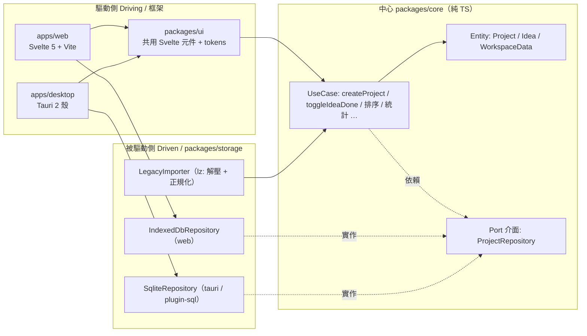

# plan.md — Ophan 點子追蹤器 開發計畫（綠地，全新設計）

> 本文件為 **全新設計（greenfield）** 的開發計畫，非既有程式碼重構。
> 所有「事實性數值」（版本、色碼、型別、欄位、儲存 key）以 `packages/core/src/index.ts` 與 `apps/web/src/app.css` 為唯一真實來源（single source of truth）。
> 規劃日期：2026-06-16。鎖定平台：**Windows x64**（v1）。

相關文件：

- 規格：`doc/spec.md`
- 任務拆解：`doc/task.md`
- 領域核心實作參考：`packages/core/src/index.ts`
- 設計系統 token 參考：`apps/web/src/app.css`

---

## ① 開發策略

整體採「**領域核心先行、契約測試驅動 adapter、Web 先於 Desktop**」的推進順序，每一階段都必須是可獨立驗證、可單獨 commit 的最小增量。

| 原則 | 落地做法 |
| --- | --- |
| 綠地（greenfield） | 不繼承既有 `apps/web` 結構，從乾淨 monorepo 起步；既有檔案僅作為**事實來源**與**相容性基準**。 |
| core 先行 | 先完成 `packages/core`（純 TS、無 DOM/IndexedDB/SQLite/Svelte/Tauri 依賴），核心穩定後才接 adapter 與 UI。 |
| 契約測試驅動 adapter | 為 `ProjectRepository` port 撰寫一份**共用契約測試（contract test）**，IndexedDB 與 SQLite 兩個 adapter 都必須通過同一份測試，確保行為一致。 |
| Web 先於 Desktop | 先用 IndexedDB adapter 把 Web 做到可用，再把同一份 UI 套進 Tauri 殼換成 SQLite adapter；降低同時引入 Rust 與新框架的風險。 |
| 每階段可驗證並 commit | 每階段附「驗證指令」，跑綠後才提交。預設分支策略：`main` 受保護，功能分支開發後合併。 |
| Conventional Commit + 繁中 | commit 訊息格式 `type(scope): 繁中描述`，type 取 `feat/fix/chore/docs/test/refactor/build/ci/perf`，scope 用套件名（`core`/`storage`/`ui`/`web`/`desktop`/`repo`）。 |

### 給不熟者：為什麼 core 先行 + 契約測試？

- core 是純函式與純資料，**不需要瀏覽器或資料庫就能用 `vitest` 跑測試**，回饋最快、最穩。
- 兩個資料庫（IndexedDB、SQLite）只要都滿足同一個 `ProjectRepository` 介面與同一份契約測試，UI 就能在 Web 與 Desktop 之間**零改動**切換。這是六角架構帶來的最大紅利。

---

## ② 架構藍圖：Ports & Adapters（六角架構）

核心理念：**業務邏輯（domain + use case）放在中心，完全不知道自己跑在瀏覽器還是桌面；外部世界（IndexedDB、SQLite、Svelte UI）透過 port 介面接進來。**



### monorepo 結構（npm workspaces）

| package | 職責 | 不可依賴 |
| --- | --- | --- |
| `packages/core` | Entity 類別、`ProjectRepository` 介面（port）、UseCase 純函式 | DOM / IndexedDB / SQLite / Svelte / Tauri |
| `packages/storage` | `IndexedDbRepository`（web）、`SqliteRepository`（tauri，用 `@tauri-apps/plugin-sql`）、`LegacyImporter` | Svelte / UI 框架 |
| `packages/ui` | 共用 Svelte 5 元件庫 + design tokens | Tauri / 具體 adapter |
| `apps/web` | Svelte 5 + Vite，注入 IndexedDB adapter | SQLite / Tauri |
| `apps/desktop` | Tauri 2 殼，載入同一份 UI，注入 SQLite adapter | — |

### SOLID 如何落地（各一句）

| 原則 | 在 Ophan 的具體落地 |
| --- | --- |
| **S**RP 單一職責 | `packages/core` 只管領域規則、`packages/storage` 只管持久化、`packages/ui` 只管呈現，三者互不越界。 |
| **O**CP 開放封閉 | 新增儲存後端（如未來雲端同步）只需新增一個實作 `ProjectRepository` 的 adapter，core 與 UI 無需修改。 |
| **L**SP 里氏替換 | `IndexedDbRepository` 與 `SqliteRepository` 皆可替換注入且通過同一份契約測試，呼叫端不需知道差異。 |
| **I**SP 介面隔離 | `ProjectRepository` 只暴露 `loadWorkspace / saveWorkspace / exportWorkspace / importWorkspace` 四個方法，不塞無關 API。 |
| **D**IP 依賴反轉 | UseCase 依賴 `ProjectRepository` **抽象**而非具體類別；具體 adapter 在 app 組裝層（composition root）才注入。 |

> 不過度設計（KISS/DRY）：單一本地資料源，**不**導入 CQRS / Event Sourcing / 多層 mediator。core 採純函式 + 不可變更新（immutable update），已足以涵蓋全部需求。

---

## ③ 階段規劃 P0–P7

> 每階段格式：**產出 / 驗證指令 / commit 訊息**。版本號一律採下方「鎖定版本表」，全部 x64 最新版。

### 鎖定版本表（2026-06-16）

| 套件 | 版本 | 套件 | 版本 |
| --- | --- | --- | --- |
| `svelte` | 5.56.3 | `@tauri-apps/api` | 2.11.0 |
| `vite` | 8.0.16 | `@tauri-apps/cli` | 2.11.2 |
| `typescript` | 6.0.3 | `@tauri-apps/plugin-sql` | 2.4.0 |
| `@sveltejs/vite-plugin-svelte` | 7.1.2 | `@tauri-apps/plugin-store` | 2.4.3 |
| `echarts` | 6.1.0 | `vitest` | 4.1.9 |
| `@lucide/svelte` | 1.18.0 | `@playwright/test` | 1.61.0 |
| `gsap` | 3.15.0 | `eslint` | 10.5.0 |
| `lz-string` | 1.5.0 | `prettier` | 3.8.4 |
| `svelte-check` | 4.6.0 | `typescript-eslint` | 8.61.1 |

---

### P0 — 骨架與工具鏈

**產出**

- npm workspaces monorepo：`packages/{core,storage,ui}`、`apps/{web,desktop}`，根 `package.json` 設 `"workspaces"`。
- `tsconfig.base.json`（已存在可沿用），各 package `extends` 之；TypeScript **6.0.3** 開啟 `strict: true`、`noUncheckedIndexedAccess`、`exactOptionalPropertyTypes`、`verbatimModuleSyntax`、`moduleResolution: "bundler"`。
- Vite **8.0.16** + `@sveltejs/vite-plugin-svelte` **7.1.2**（`apps/web`）。
- ESLint **10.5.0**（flat config `eslint.config.js`）+ `typescript-eslint` **8.61.1** + Prettier **3.8.4**；`eslint-plugin-svelte`。
- `svelte-check` **4.6.0**。
- CI（GitHub Actions，`runs-on: windows-latest`，Node 22 LTS x64）：`install → check → lint → test → build`。
- 根 npm scripts：`dev / build / check / lint / format / test`。

**驗證指令**

```bash
npm install
npm run check     # svelte-check 0 errors
npm run lint      # eslint 0 errors
npm run build     # 全 workspace type-check + 建置
```

**commit 訊息**

```
chore(repo): 建立 monorepo 骨架與工具鏈（Vite8 / TS6 strict / ESLint10 / Prettier / CI）
```

---

### P1 — `packages/core`（領域核心）

**產出**（對齊 `packages/core/src/index.ts` 既有事實）

- 常數：`WORKSPACE_SCHEMA_VERSION = 1`。
- 型別：`Project`、`Idea`、`WorkspaceData`、`ProjectRepository`（port）、`ProjectStats`、`CompletionLogEntry`。
- 列舉：`ProjectCategory = "CI"|"MP"|"SP"|null`、`IdeaFilter = "todo"|"done"|"all"`。
- 工具：`createId()`（`crypto.randomUUID()`，fallback `id_${Date.now()}_${random16}`）、`nowIso()`（`new Date().toISOString()`）、`toIsoTimestamp()`（毫秒 number / 字串 → ISO）、`normalizeCategory()`。
- UseCase 純函式（皆回傳新的 `WorkspaceData`，不可變更新 + `touchWorkspace` 更新 `meta.updatedAt`）：
  `createProject / updateProject / deleteProject`（軟刪除：連帶設 idea `deletedAt`）、
  `createIdea / updateIdea / deleteIdea / toggleIdeaDone / toggleProjectPin / toggleIdeaPin`、
  `moveProject / moveIdea`（±1）、`moveProjectTo / moveIdeaTo`（拖放到目標前）。
- 查詢：`getVisibleProjects / getIdeasForProject / getFilteredIdeas / getProjectStats / getCompletionLog`。

**欄位預設值（不變量，必入測試）**

| 實體 | 欄位 | 預設 / 規則 |
| --- | --- | --- |
| Project | `name` | `"Untitled project"` |
| Project | `description` | `""` |
| Project | `category` | `null`（`"CI"|"MP"|"SP"|null`） |
| Project | `startDate`/`dueDate` | `null`（`YYYY-MM-DD`） |
| Project | `pinned` | `false` |
| Project | `order` | 尾端（`getVisibleProjects().length`） |
| Idea | `text` | `"Untitled idea"` |
| Idea | `done`/`pinned` | `false` |
| Idea | `finishedAt` | `done` false→true 設 `now`；true→false 設回 `null` |
| 共用 | `createdAt`/`updatedAt` | ISO 8601；`deletedAt` 軟刪除 |

**排序語意（必測）**：`pinned` 優先 → `order` 升冪 → `updatedAt.localeCompare`（見 `sortWorkItems`）。

**vitest 單元測試覆蓋**：不變量（預設值、軟刪除連動）、排序（pinned/order/updatedAt 三層）、篩選（`getFilteredIdeas` todo/done/all）、統計（`getProjectStats.percent = round(done/total*100)`，total 0 → 0）、完成記錄（`getCompletionLog` 依 `finishedAt` 降冪）。

**驗證指令**

```bash
npm run test --workspace packages/core   # vitest 全綠
npm run check
```

**commit 訊息**

```
feat(core): 實作領域實體、Repository port 與 UseCase 純函式（含不變量/排序/篩選/統計單元測試）
```

#### 給不熟者：為什麼用「純函式 + 不可變更新」而非 class 突變？

每個 UseCase 接收舊 `WorkspaceData`、回傳**新的** `WorkspaceData`，舊物件不被改動。好處是測試只需比對輸入/輸出、Svelte 5 runes 的 `$state` 能精準偵測引用變化而重繪。`Project`/`Idea` 以 `interface` 描述資料即可，不需要繼承式 class。

---

### P2 — `packages/storage`（adapters + 契約測試）

**產出**

- `IndexedDbRepository`（web）：db `"ophan"`、store `"workspace"`、key `"current"`，值為序列化 `WorkspaceData`。
- `LegacyImporter`：
  - 讀 legacy LocalStorage key `project-idea-collection.v1`；若值以 `"lz:"` 前綴，用 `lz-string` **1.5.0** 的 `decompressFromUTF16` 解壓後再 `JSON.parse`。
  - legacy 主題/UI key：`project-idea-collection.theme`、`project-idea-collection.ui`。
  - 正規化走 core 的 `importWorkspaceJson` / `normalizeWorkspace`：自動偵測 array / 巢狀 object / 新版扁平；回填 `updatedAt`、`deletedAt: null`、`order`（依索引）、`createdAt`（毫秒→ISO）；巢狀 `ideas` 攤平為扁平 + `projectId`。
- `SqliteRepository`（tauri，用 `@tauri-apps/plugin-sql` **2.4.0**）：三表 `projects / ideas / meta`，需與 `WorkspaceData` **1:1 round-trip**。
- **共用契約測試**：一份測試套件，分別注入兩個 repository 跑 `save → load` 等價、`export → import` 等價、空 workspace 行為一致。

**legacy 格式對照（匯入正規化基準）**

| 來源 | 形態 | 正規化後 |
| --- | --- | --- |
| Legacy `Project` | `{id,name,description,startDate,dueDate,category,pinned,ideas:[…]}`（巢狀） | 攤平：`ideas` 抽出為頂層 `ideas[]` + 回填 `projectId` |
| Legacy `Idea` | `{id,text,done,createdAt(毫秒 number),finishedAt,pinned}` | `createdAt` 毫秒→ISO、補 `order/updatedAt/deletedAt` |

**新設計 Desktop SQLite schema（1:1 round-trip 回 `WorkspaceData`）**

```sql
CREATE TABLE projects (
  id TEXT PRIMARY KEY, name TEXT NOT NULL, description TEXT NOT NULL DEFAULT '',
  category TEXT,                       -- 'CI'|'MP'|'SP'|NULL
  start_date TEXT, due_date TEXT,      -- YYYY-MM-DD | NULL
  pinned INTEGER NOT NULL DEFAULT 0,   -- 0|1
  "order" INTEGER NOT NULL,
  created_at TEXT NOT NULL, updated_at TEXT NOT NULL, deleted_at TEXT
);
CREATE TABLE ideas (
  id TEXT PRIMARY KEY, project_id TEXT NOT NULL,
  text TEXT NOT NULL, done INTEGER NOT NULL DEFAULT 0, pinned INTEGER NOT NULL DEFAULT 0,
  "order" INTEGER NOT NULL,
  created_at TEXT NOT NULL, updated_at TEXT NOT NULL, finished_at TEXT, deleted_at TEXT,
  FOREIGN KEY (project_id) REFERENCES projects(id)
);
CREATE TABLE meta (             -- 單列：對應 WorkspaceData.meta + schemaVersion
  schema_version INTEGER NOT NULL,        -- 1
  app_name TEXT NOT NULL,                 -- 'ophan'
  updated_at TEXT NOT NULL, device_id TEXT NOT NULL
);
```

> 映射規則：`boolean ↔ INTEGER(0/1)`、`null ↔ NULL`，讀出後在 adapter 內轉回 `WorkspaceData`，再交給 core；core 完全不知道 SQLite 存在（DIP）。

**驗證指令**

```bash
npm run test --workspace packages/storage   # 兩 adapter 皆通過契約測試
npm run check
```

**commit 訊息**

```
feat(storage): IndexedDB / SQLite adapter 與 LegacyImporter（lz: 解壓），共用 Repository 契約測試
```

#### 給不熟者：`@tauri-apps/plugin-sql` 與 SQLite

`@tauri-apps/plugin-sql` 讓前端 TS 直接 `import Database from '@tauri-apps/plugin-sql'`、用 `await db.execute(sql, params)` / `db.select(sql)` 操作本地 SQLite，**幾乎不需要寫 Rust**。官方文件：<https://v2.tauri.app/plugin/sql/>。SQLite 語法參考：<https://www.sqlite.org/lang.html>。

---

### P3 — `packages/ui`（design tokens、主題、skeleton、基礎元件）

**產出**

- **Design tokens**（CSS custom properties，對齊 `apps/web/src/app.css`）：

| token | Light | Dark |
| --- | --- | --- |
| `--bg` | `#f6f6f1` | `#0b1116` |
| `--bg-soft` | `#f9efe4` | `#141f28` |
| `--surface` | `#ffffff` | `#161f27` |
| `--surface-2` | `#f1f4f0` | `#1b2630` |
| `--ink` | `#0d1b2a` | `#f4f6f9` |
| `--muted` | `#5b6473` | `#b1bcc7` |
| `--accent` | `#1f8a70` | `#33c1a0` |
| `--accent-ink` | `#176b56` | `#66dfc4` |
| `--accent-2` | `#e9b44c` | `#f0c56d` |
| `--accent-2-ink` | `#705018` | `#f0c56d`（dark 刻意讓 `--accent-2-ink` === `--accent-2`） |
| `--danger` | `#d1495b` | `#e06c7c` |
| `--border` | `rgba(13,27,42,0.1)` | — |
| `--border-strong` | `rgba(13,27,42,0.18)` | — |
| `--shadow-pop` | `0 8px 24px rgba(13,27,42,0.12)` | `0 8px 24px rgba(4,8,12,0.5)` |

- 漸層：`--grad-accent = linear-gradient(90deg, var(--accent), var(--accent-2))`、`--grad-border` 雙色描邊；大量使用 `color-mix(in srgb, …)`。
- 字體：`--font-ui = "Chiron GoRound TC","Noto Sans TC","Microsoft JhengHei",sans-serif`（display/mono 同 ui）。
- 字級：標題 `clamp(20px,2.4vw,27px)`/lh1.1、hero `clamp(32px,5vw,58px)`、dialog 標題 21px、brand 18px、正文 14px/lh1.65、panel/idea 13.5px w600、小字 12.5/12/11.5/11/10.5/10/9.5px。
- 圓角：pill `999px`、18/16/14/12/10/9/8/6px。
- 主題：以 `:root[data-theme="dark"]` 切換（對齊 legacy `document.documentElement.dataset.theme`）。
- **多樣式 skeleton shimmer**：`--surface-2` 底、`shimmer` `@keyframes { to { transform: translateX(100%) } }` `1.4s infinite`；`.line` `min-height:14px` `radius:6px`。至少提供 `line / block / card / chart` 多種變體。
- 基礎元件（Svelte 5 runes）：`Button / IconButton / Chip / Pill / ProgressBar / Tabs / Dialog / Toast / Skeleton`。
- 圖示：`@lucide/svelte` **1.18.0**，尺寸 13/16/18/19px、`strokeWidth 2.4`、`fill none`；**嚴禁 emoji**。

**驗證指令**

```bash
npm run check
npm run build --workspace packages/ui
```

**commit 訊息**

```
feat(ui): design tokens / 主題切換 / 多樣式 skeleton shimmer 與基礎元件庫
```

#### 給不熟者：Svelte 5 runes

只用 runes 模式：`$state`（可變狀態）、`$derived`（衍生值）、`$effect`（副作用，類似 React `useEffect`）、事件用 `onclick`（不用舊的 `on:click` / `$:`）。官方教學：<https://svelte.dev/docs/svelte/what-are-runes>、互動教學：<https://svelte.dev/tutorial>。

---

### P4 — `apps/web`（app-shell、三欄、runes 狀態、CRUD、匯入）

**產出**

- **app-shell**：`grid-template-rows: auto minmax(0,1fr)`、`height:100dvh`、`padding:14px`、`body { overflow: hidden }`（無外層捲動，各欄獨立捲動）。
- **workspace 三欄**：`grid-template-columns: var(--rail-w) minmax(0,1fr) var(--log-w)`，`--rail-w:314px`、`--log-w:354px`，收合設 `0px`，`transition 0.28s cubic-bezier(0.4,0,0.2,1)`。右欄預設收合。
- **runes 狀態模組（`.svelte.ts`）**：
  - `state/app.svelte.ts` — workspace 資料 + 所有 action（注入 `ProjectRepository`，呼叫 core UseCase 後 `persist`）。
  - `state/ui.svelte.ts` — 主題、面板收合、類別篩選，持久化到 `ophan.ui`。
  - `state/dialogs.svelte.ts` — dialog 開關。

  （i18n `state/i18n.svelte.ts` 屬 **P7**，避免在 P4 提前散落翻譯字串；見 P7。）
- **元件**：`Topbar / ProjectRail / IdeaPanel / CompletionPanel / ProjectDialog / ConfirmDialog`（多數來自 `packages/ui`，app 僅做組裝）。
- **CRUD**：建專案、增/改/刪點子、拖放排序、切換完成、pin/unpin、類別篩選 chips `CI/MP/SP/NA`（NA = `null` 未分類，對齊 `ProjectCategoryFilter`）。
- **匯入入口**：匯出 JSON、匯入 JSON、匯入 legacy（透過 `LegacyImporter`）。
- **localStorage keys**：`ophan.device-id`、`ophan.theme`（`light|dark`）、`ophan.ui`、`ophan.locale`（`en|zh-TW`）。
  `ophan.ui` 結構：`{ railCollapsed:false, logCollapsed:true, categoryFilters:[] }`。

**驗證指令**

```bash
npm run dev      # http://localhost:5173/ 手動跑 CLAUDE.md 測試清單
npm run check
npm run build
```

**commit 訊息**

```
feat(web): app-shell 三欄佈局、runes 狀態（app/ui/dialogs）、CRUD 與匯入入口
```

> 組裝層（composition root）在 `apps/web/src/main.ts`：`new IndexedDbRepository()` 注入 `app.svelte.ts`。Desktop 之後只換成 `SqliteRepository`，其餘共用。

---

### P5 — `apps/desktop`（Tauri 2 殼 + SQLite）

**產出**

- Tauri 2 殼：`@tauri-apps/api` **2.11.0** + `@tauri-apps/cli` **2.11.2**，載入**同一份 `packages/ui`**。
- 注入 `SqliteRepository`（`@tauri-apps/plugin-sql` **2.4.0**，三表 schema 見 P2）取代 IndexedDB。
- `@tauri-apps/plugin-store` **2.4.3**：偏好（主題/locale/UI）以原生 store 持久化。
- 原生選單 / 視窗：標準視窗控制、最小尺寸、選單列（檔案匯入/匯出、主題切換）。
- auto-update：Tauri updater 設定 + 簽章金鑰。
- **x64 打包與簽章**：v1 僅 Windows x64，產 `.msi`（WiX）/ `.exe`（NSIS），Authenticode 簽章（對應 task 里程碑 **M3**）。
- **Rust 接觸面（最小化）**：

| Rust 檔案 | 內容 | 是否常改 |
| --- | --- | --- |
| `src-tauri/tauri.conf.json` | 視窗、bundle、updater、權限 capabilities 設定 | 偶爾 |
| `src-tauri/src/main.rs` / `lib.rs` | `tauri::Builder` 註冊 plugin（sql、store、updater），無業務邏輯 | 幾乎不改 |
| `src-tauri/Cargo.toml` | Rust 相依與 feature | 偶爾 |
| `src-tauri/capabilities/*.json` | 權限白名單（sql/store/window） | 新增原生能力時 |

**驗證指令**

```bash
npm run tauri dev      # 桌面殼啟動、SQLite 讀寫、選單可用
npm run tauri build    # 產 x64 安裝包
npm run check
```

**commit 訊息**

```
feat(desktop): Tauri 2 殼接入 SQLite repository、原生選單/視窗、auto-update 與 x64 簽章打包
```

#### 給不熟者：Tauri 2 與 Rust 最小化

Tauri 把前端打包成原生視窗（Windows 走 WebView2），業務邏輯**留在前端 TS**，Rust 只負責殼層設定與必要原生橋接。官方文件：<https://v2.tauri.app/>、Rust 入門（僅需基礎）：<https://doc.rust-lang.org/book/>、SQL plugin：<https://v2.tauri.app/plugin/sql/>。維護者多數時間不會碰 Rust。

---

### P6 — 相容性與資料遷移（round-trip 硬地基）

> 資料相容是最高優先：使用者既有匯出檔與 legacy 資料必須無損匯入。本階段把相容性獨立成可驗證的測試矩陣（對應 task 里程碑 **M4**）。

**產出**

- **legacy array JSON 匯入**：`importWorkspaceJson` 偵測陣列 → 攤平巢狀 ideas → 補 `projectId` / 回填預設值。
- **legacy LocalStorage（含 `lz:` 壓縮）匯入**：`LegacyImporter` 讀 `project-idea-collection.v1`，`lz-string` `decompressFromUTF16` 解壓。
- **SQLite ↔ `WorkspaceData` round-trip**：Desktop 三表 `save → load → export` 與 JSON 1:1 等價。
- **跨格式相容矩陣**：`legacy → web(IndexedDB) → desktop(SQLite)` 三方互通，`export → import` 冪等。
- 全部以 `vitest` 契約測試固定（`normalizeWorkspace` 為唯一正規化入口，冪等）。

**驗證指令**

```bash
npx vitest run packages/storage   # round-trip / legacy 契約測試全綠（對應 M4）
npm run check
```

**commit 訊息**

```
test(storage): 補齊 legacy / web / desktop 跨格式相容 round-trip 測試矩陣
```

---

### P7 — 動效 / 效能 / 品質 / 上線

**產出**

- **GSAP 3.15.0 進場**：timeline `duration 0.45 ease power2.out`；bars `y:-12 stagger0.05`、panels `y:16 stagger0.08`、cards `y:10 stagger0.04`。
- **Svelte 過場 + 進度動效**：`animate:flip` `motionMs(240)`、`transition:slide` `motionMs(160)`、`fade` `motionMs(140)`；進度條 `width 0.4s cubic-bezier(0.22,1,0.36,1)`；按壓 active `transform: translateY(1px) scale(0.98)`。
- **reduced-motion 總閘 + 響應式斷點**：`@media (prefers-reduced-motion)` 下所有動畫降為 `0.01ms`、`shimmer` 停用；斷點 `900px`（平板單欄）/ `560px`（手機）；`(hover:none)` 觸控裝置改常駐操作鈕。
- **延遲載入 / 視差 / code-split**：ECharts 6.1.0 動態 `import()` 維持獨立 chunk（約 509KB，僅右欄首開載入，`$effect` 讀 CSS 變數做主題同步、14 天 bucket 聚合）；hero / 背景層輕量 parallax（可參考 legacy `PolyBackground` canvas 多邊形互動背景；palette line `#1f8a70`、accent `#e9b44c`；reduced-motion 下停用）；skeleton shimmer `1.4s infinite`（P3 多樣式變體）撐場。
- **i18n（en / zh-TW）**：建立 `packages/ui/src/i18n/`（`en.ts` / `zh-TW.ts` / `index.ts`）與 `state/i18n.svelte.ts` `Locale` 切換，持久化 `ophan.locale`（桌面端用 `plugin-store`）；技術名詞與識別字保留原文。
- **a11y 與品質總檢**：焦點順序、`focus-visible outline 2px var(--accent) offset2`、focus ring `box-shadow 0 0 0 3px color-mix(accent 18% transparent)`、對比度、native `<dialog>` 鍵盤行為、icon 皆有 accessible label、**全站零 emoji**；`eslint` / `prettier` / `svelte-check` 全綠。
- **效能預算**：初始 bundle 預算、ECharts 獨立 chunk、Lighthouse 基準。
- **上線文件**：`README.md` 與本 `plan.md` / `spec.md` / `task.md` 及「給不熟者」段落對齊最終實作。

**驗證指令**

```bash
npm run test            # 全 workspace 單元 + 契約測試
npx playwright test     # e2e / a11y 全綠
npm run check           # 0 errors
npm run build
```

**commit 訊息**

```
feat(web): GSAP 進場、flip/slide/fade 過場、ECharts 延遲載入與 reduced-motion 總閘
feat(ui): 加入 en / zh-TW 雙語切換
test(web): 補齊 Playwright e2e、a11y 稽核與效能預算
docs(repo): 定稿 README 與 plan / spec / task
```

---

## ④ 風險與緩解

| 風險 | 影響 | 緩解 |
| --- | --- | --- |
| 維護者不熟 Svelte runes | P3 / P4 / P7 維護成本高 | 每個不熟點附「給不熟者」段 + 官方入門連結；`packages/ui` 提供最小可複製範例元件；CI 跑 `svelte-check` 擋低級錯誤。 |
| 維護者不熟 Rust / Tauri | P5 卡關 | Rust 最小化（業務邏輯全在 TS）；列出「Rust 接觸面」表，明確標示幾乎不改的檔案；附 Tauri / Rust 官方連結。 |
| Tauri 跨平台差異 | 多平台維護爆炸 | **v1 聚焦 Windows x64**（WebView2 / WiX / NSIS / Authenticode）；macOS/Linux 延後並於文件標注。 |
| 套件升級破壞相容 | 建置或行為回歸 | **鎖定版本**（見鎖定版本表，全部 x64 最新版）+ `package-lock.json`；CI 在 `windows-latest` 跑 `check/lint/test/build`；升級走獨立分支 + 契約/e2e 把關。 |
| 資料相容性破損 | 使用者資料遺失（最嚴重） | 相容性 round-trip 測試列為 P6 必過項；core `normalizeWorkspace` 為唯一正規化入口；匯入前不覆寫、保留匯出備份路徑。 |
| ECharts 體積拖慢首屏 | 效能不佳 | 動態 `import()` code-split（約 509KB 獨立 chunk），僅右欄首開載入；其餘以 skeleton shimmer 撐場。 |
| 過度設計 | 維護負擔 | 嚴守 KISS/DRY：單一本地資料源不導入 CQRS / Event Sourcing；core 維持純函式 + 不可變更新。 |

---

### 附錄：commit 類型速查（Conventional Commit + 繁中）

| type | 用途 | 範例 |
| --- | --- | --- |
| `feat` | 新功能 | `feat(core): 新增 toggleIdeaDone 完成切換` |
| `fix` | 修錯 | `fix(web): 修正面板收合狀態未持久化` |
| `test` | 測試 | `test(storage): 補 SQLite round-trip 契約測試` |
| `docs` | 文件 | `docs(repo): 更新 plan.md 階段規劃` |
| `chore` | 雜項/設定 | `chore(repo): 鎖定相依版本` |
| `refactor` | 重構 | `refactor(ui): 抽出 Skeleton 變體` |
| `build`/`ci` | 建置/CI | `ci(repo): Windows x64 流水線` |
| `perf` | 效能 | `perf(web): ECharts 延遲載入` |
