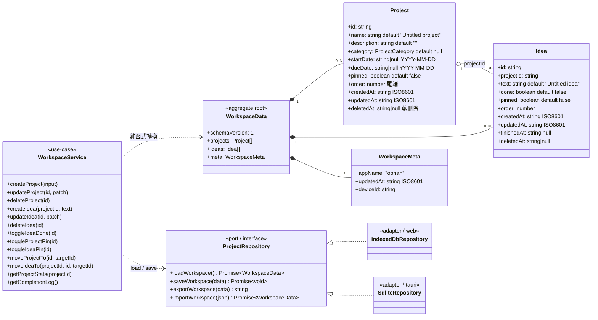

# spec.md — Ophan 點子追蹤器 規格書（全新設計）

> 本文件為 **綠地（greenfield）規劃**，非既有程式碼的重構紀錄。所有「事實性數值」（版本、色碼、型別、欄位）皆與下列來源對齊：
> 領域型別／use-case：`packages/core/src/index.ts`；設計系統：`apps/web/src/app.css`；資料相容性細節：`doc/data-structure.md`。
> 撰寫日期基準：2026-06-16。語言：繁體中文（zh-TW），技術名詞與識別字保留原文。

---

## 目錄

1. [目標與範圍](#1-目標與範圍)
2. [名詞與領域語彙](#2-名詞與領域語彙)
3. [物件導向領域模型](#3-物件導向領域模型)
4. [功能規格逐項](#4-功能規格逐項)
5. [非功能性需求](#5-非功能性需求)
6. [平台需求](#6-平台需求)
7. [技術選型與理由](#7-技術選型與理由)
8. [資料相容性需求](#8-資料相容性需求)
9. [驗收條件](#9-驗收條件)
10. [範圍外](#10-範圍外)

---

## 1. 目標與範圍

### 1.1 產品目標

Ophan 是一個**點子（idea）追蹤器**：使用者建立專案（Project），在專案下管理多筆點子（Idea），追蹤完成進度與完成紀錄。本次為全新設計，目標是在**同一份領域核心與共用 UI** 之上，同時交付 **Web** 與 **Desktop（Tauri 2）** 兩種殼，僅替換儲存 adapter。

### 1.2 範圍（v1 In Scope）

| 範疇 | 內容 |
| --- | --- |
| 功能等價 | 涵蓋既有 idea tracker 全部核心功能（專案/idea CRUD、todo/done/all、進度與完成 log、pin、拖曳排序、分類篩選、JSON 匯出入、legacy 匯入、light/dark、i18n、14 天趨勢圖） |
| 雙平台 | `apps/web`（瀏覽器，IndexedDB）+ `apps/desktop`（Tauri 2，SQLite），載入同一份 `packages/ui` |
| 離線優先 | 所有資料存於本機（IndexedDB / SQLite），不需要網路即可完整運作 |
| 資料相容 | 必須能匯入既有 `WorkspaceData`（`schemaVersion: 1`）與所有 legacy 格式（見第 8 章） |

### 1.3 不在 v1 範圍（Out of Scope，詳見第 10 章）

- **雲端同步 / 多裝置同步 / 帳號系統**：v1 不做。架構需保留日後加入 remote repository adapter 的空間，但不在本版實作。
- 不移植任何展示型附加功能（splash video、service/model monitor、auto update dialog、CLI 文案等）。

> 設計準則：遵守 **SOLID / KISS / DRY**，**不過度設計**。單一本機資料源不套用 CQRS / Event Sourcing；以 Ports & Adapters（六角架構）達成可替換儲存，已足夠。

---

## 2. 名詞與領域語彙

| 名詞 | 定義 |
| --- | --- |
| **Workspace** | 聚合根（aggregate root）。一份使用者資料的完整快照，序列化為 `WorkspaceData`。對應 IndexedDB key `current` / SQLite 全表。 |
| **Project** | 專案實體。擁有 0..N 個 Idea。 |
| **Idea** | 點子實體，必定隸屬於某個 Project（`projectId`）。 |
| **Category** | 專案分類列舉：`CI` / `MP` / `SP` / `null`（未分類）。 |
| **IdeaFilter** | idea 視圖模式：`todo` / `done` / `all`。 |
| **ProjectCategoryFilter** | 專案列篩選 chip：`CI` / `MP` / `SP` / `NA`，其中 `NA` 代表 `category === null`（未分類）。 |
| **Soft delete（軟刪除）** | 設定 `deletedAt` 為時間戳即視為刪除；資料仍保留於陣列，但不可見。 |
| **Pin（浮頂）** | `pinned: true` 的項目在排序時優先置頂。 |
| **Completion log（完成紀錄）** | 所有 `done && finishedAt` 的 idea，依 `finishedAt` 由新到舊排列。 |
| **Port** | 與框架無關的介面（如 `ProjectRepository`）。 |
| **Adapter** | Port 的具體實作（如 `IndexedDbRepository`、`SqliteRepository`）。 |
| **Theme** | `light` / `dark`。 |
| **Locale** | `en` / `zh-TW`。 |

### 2.1 列舉一覽（事實性）

```ts
type ProjectCategory       = "CI" | "MP" | "SP" | null;   // packages/core/src/index.ts
type IdeaFilter            = "todo" | "done" | "all";
type ProjectCategoryFilter = "CI" | "MP" | "SP" | "NA";   // NA = null 未分類
type Theme                 = "light" | "dark";
type Locale                = "en" | "zh-TW";
```

---

## 3. 物件導向領域模型

模型集中在 `packages/core`，**與框架無關**（不依賴 DOM / IndexedDB / SQLite / Svelte / Tauri）。

### 3.1 類別關係圖



> 注意：`ideas` 是**扁平陣列**（非巢狀於 Project 內），透過 `Idea.projectId` 關聯。聚合根的不可變更新（immutable update）由 core 的純函式負責，UI 只持有最新快照。

### 3.2 不變量（Invariants）

| # | 不變量 | 規則來源 |
| --- | --- | --- |
| INV-1 | **pinned 浮頂**：可見清單排序為 `pinned 優先 → order 升冪 → updatedAt localeCompare`。 | `sortWorkItems()` |
| INV-2 | **軟刪除即不可見**：`deletedAt !== null` 的 Project / Idea 不出現在任何可見清單。 | `getVisibleProjects()` / `getIdeasForProject()` |
| INV-3 | **刪除 Project 連動 Idea**：刪除專案時，其底下所有 idea 同步設定 `deletedAt`。 | `deleteProject()` |
| INV-4 | **finishedAt 規則**：`done` 由 `false→true` 時 `finishedAt = now`；`true→false` 時 `finishedAt = null`。 | `toggleIdeaDone()` |
| INV-5 | **completion log 條件**：僅 `!deletedAt && done && finishedAt` 的 idea 進入完成紀錄，並依 `finishedAt` 由新到舊排序。 | `getCompletionLog()` |
| INV-6 | **任何寫入皆更新時間戳**：被異動的 Project / Idea 更新 `updatedAt`，同時 `meta.updatedAt` 透過 `touchWorkspace()` 更新。 | 各 use-case |
| INV-7 | **預設值**：`name` 空白時回退 `"Untitled project"`；`text` 空白時回退 `"Untitled idea"`。新建 `order` 取可見清單尾端。 | `createProject()` / `createIdea()` |

### 3.3 共用語意常數（事實性）

| 項目 | 規則 |
| --- | --- |
| ID 生成 | `crypto.randomUUID()`，不可用時回退 `id_${Date.now()}_${Math.random().toString(16).slice(2)}` |
| 時間戳 | ISO 8601（`new Date().toISOString()`） |
| 日期欄位 | `YYYY-MM-DD`（`startDate` / `dueDate`） |
| 進度百分比 | `total === 0 ? 0 : Math.round(done / total * 100)` |

> **「給不熟者」— 為什麼用純函式而非 class 方法改值？**
> core 採用「不可變更新」：每個 use-case 接收舊 `WorkspaceData`、回傳**新的** `WorkspaceData`，不在原物件上 mutate。好處是 Svelte 5 runes 的 `$state` 只要重新賦值就會觸發精準更新，且容易測試（輸入 → 輸出，無副作用）。延伸閱讀：[MDN — 純函式概念](https://developer.mozilla.org/en-US/docs/Glossary/Pure_function)。

---

## 4. 功能規格逐項

> 每條功能對應一個 **FR 編號**，供 `plan.md` / `task.md` 追溯，並對應第 9 章驗收條件（AC）。

### FR-1 專案 CRUD

- **建立**：表單輸入 `name`（必填，空白回退 `"Untitled project"`）、`description`、`category`（CI/MP/SP/未分類）、`startDate`、`dueDate`。新專案 `pinned=false`、`order` 為可見清單尾端、`deletedAt=null`。
- **編輯**：可改 `name` / `description` / `category` / `startDate` / `dueDate`，更新 `updatedAt`。
- **刪除**：軟刪除（設 `deletedAt`），並連動軟刪除底下所有 idea（INV-3），需 `ConfirmDialog` 二次確認。
- 對應：`createProject` / `updateProject` / `deleteProject`。

### FR-2 Idea CRUD

- **建立**：在 IdeaPanel 輸入列輸入文字 → Enter / 送出。空白回退 `"Untitled idea"`，`order` 取尾端。
- **編輯**：inline 編輯文字（`idea-edit` 樣式）。
- **刪除**：軟刪除。
- 對應：`createIdea` / `updateIdea` / `deleteIdea`。

### FR-3 todo / done / all 視圖

- 分段控制（segmented，`.segmented`）三個分頁：`todo` / `done` / `all`，各顯示計數。
- 篩選語意：`done` 僅顯示 `idea.done === true`；`todo` 僅顯示 `false`；`all` 全部（皆排除軟刪除）。
- 對應：`getFilteredIdeas(workspace, projectId, filter)`。

### FR-4 進度統計與完成紀錄（log）

- **進度統計**：每專案 `{ total, done, todo, percent }`。progress bar 寬度以 `percent` 驅動（`--grad-accent` 漸層，`width 0.4s cubic-bezier(0.22,1,0.36,1)`）。
- **完成紀錄**：右側 CompletionPanel 列出 completion log（INV-5），`hover` 顯示 reopen 按鈕（將 idea 由 done 切回 todo，`finishedAt` 設回 null）。
- 對應：`getProjectStats` / `getCompletionLog` / `toggleIdeaDone`。

### FR-5 Pin（專案與 idea）

- 切換 `pinned`，pin 後該項目在所屬清單浮頂（INV-1）。卡片顯示 `pin-indicator`（`--accent-2-ink`）。
- 對應：`toggleProjectPin` / `toggleIdeaPin`。

### FR-6 拖曳排序（pinned 浮頂）

- 採用原生 HTML5 Drag & Drop。拖曳中卡片 `opacity: 0.45`、`cursor: grabbing`；drag-over 目標顯示 `--grad-border` 描邊。
- 排序仍受 INV-1 約束：pinned 永遠在前；拖曳改寫的是 `order`。
- 重排序動畫：Svelte `animate:flip`（240ms）。
- 對應：`moveProjectTo` / `moveIdeaTo`（以及鍵盤上下移的 `moveProject` / `moveIdea`，`direction: -1 | 1`）。

### FR-7 分類篩選（CI / MP / SP / NA）

- ProjectRail 頂部 filter chips：`CI` / `MP` / `SP` / `NA`（NA = `category === null`）。可多選，狀態存於 `ophan.ui.categoryFilters`（陣列）。
- 篩選為前端純運算，不影響資料本體。

### FR-8 JSON 匯出 / 匯入

- **匯出**：`exportWorkspaceJson(workspace)` → 經 `normalizeWorkspace` 正規化後 `JSON.stringify(…, null, 2)`，下載為 `.json`。
- **匯入**：`importWorkspaceJson(json)` → `normalizeWorkspace(JSON.parse(json))`，自動偵測格式（見第 8 章），完成後覆寫工作區並 `saveWorkspace`。

### FR-9 Legacy 匯入轉移

- 偵測瀏覽器 localStorage key `project-idea-collection.v1`（含 `lz:` 壓縮前綴）並提供匯入入口。
- 支援巢狀 legacy 格式（Project 內嵌 `ideas`）攤平為扁平 `ideas[] + projectId`。
- 詳見第 8 章與 `doc/data-structure.md`。

### FR-10 Light / Dark 主題

- 以 `document.documentElement.dataset.theme`（`:root[data-theme="dark"]`）切換 CSS 變數。偏好持久化於 `ophan.theme`。
- 切換需即時反映於 ECharts 圖表（見 FR-12）。

### FR-11 i18n（繁中 / 英文）

- 兩種 locale：`en` / `zh-TW`，持久化於 `ophan.locale`。切換即時更新介面字串。
- 預設依瀏覽器語言推測，無法判定則 `en`。

### FR-12 ECharts 14 天趨勢圖（延遲載入）

- 位於 CompletionPanel，line + smooth，依 `finishedAt` 做 **14 天 bucket 聚合**。
- **延遲載入**：僅在右欄首次展開時 `import()` 動態載入 ECharts（獨立 chunk，約 509KB code-split）。載入前以 `trend-skeleton`（shimmer）佔位。
- 主題同步：`$effect` 讀取 CSS 變數，主題切換時重繪。

---

## 5. 非功能性需求

### 5.1 效能

| 項目 | 需求 |
| --- | --- |
| 首屏 | 載入/重整時以 **skeleton shimmer** 佔位（多種樣式：卡片塊、`.line` 文字列、trend 區塊），shimmer `@keyframes { to { transform: translateX(100%) } }` `1.4s infinite`。 |
| Code-split | ECharts 不進入主 bundle，僅首次展開右欄時動態載入（獨立 chunk）。 |
| 動效預算 | GSAP 進場 timeline `duration 0.45 ease power2.out`；`prefers-reduced-motion` 下所有動畫降為 `0.01ms`。 |
| 視差/延遲載入 | 可使用 GSAP、延遲載入、視差滾動營造現代感，但不得阻塞首屏互動。 |

### 5.2 可維護性（SOLID / KISS / DRY）

- **SRP**：core（領域）、storage（adapter）、ui（呈現）、app（殼）職責分離。
- **DIP**：UI 依賴 `ProjectRepository` 抽象，不依賴具體儲存。
- **DRY**：匯入 / 正規化 / 匯出邏輯**集中於 core/storage**，不在 UI 重複。
- **KISS**：不為單一本機資料源套用 CQRS / Event Sourcing。
- 文件需讓**熟 Web 但不熟 Svelte / Rust** 的資深工程師可維護（各技術附「給不熟者」段落與官方連結，見第 7 章）。

### 5.3 可存取性（a11y）

- 鍵盤可操作：拖曳排序需有上下移按鈕替代；`focus-visible` outline `2px var(--accent)` offset `2`；focus ring `box-shadow 0 0 0 3px color-mix(accent 18% transparent)`。
- 圖示一律 `@lucide/svelte`，**嚴禁 emoji**；裝飾性圖示需有對應文字標籤 / `sr-only`。
- 尊重 `prefers-reduced-motion` 與 `(hover: none)`（觸控裝置常駐顯示卡片動作鈕）。

### 5.4 離線優先

- 無網路即可完整 CRUD。所有資料存本機（Web: IndexedDB；Desktop: SQLite）。

### 5.5 套件與平台基準

- 所有套件採**最新版且 x64**，版本見第 7 章表格。

---

## 6. 平台需求

### 6.1 Web

| 項目 | 需求 |
| --- | --- |
| 瀏覽器 | 近兩年版 Chromium / Firefox / Safari（支援 `color-mix()`、`100dvh`、`<dialog>`、IndexedDB、`crypto.randomUUID`） |
| 儲存 | IndexedDB（`db="ophan"`、`store="workspace"`、`key="current"`） |
| 佈署 | 靜態檔（Vite build 產物） |

### 6.2 Desktop（Tauri 2，主攻 Windows x64）

| 項目 | 需求 |
| --- | --- |
| 殼 | Tauri 2，Rust 最小化（業務邏輯留前端 TS，Rust 僅殼層設定與必要原生橋接） |
| 目標平台 | **Windows x64** 為主要交付目標 |
| 儲存 | SQLite，透過 `@tauri-apps/plugin-sql`；schema 需能 **1:1 round-trip** 回 `WorkspaceData`（projects / ideas / meta 三表） |
| Webview | Windows 使用系統 WebView2（Edge/Chromium）；CSS 與 Web 版一致 |
| UI 共用 | 載入同一份 `packages/ui`，僅替換儲存 adapter 為 `SqliteRepository` |

---

## 7. 技術選型與理由

> 以下版本為 **2026-06-16 查證之最新版，全部 x64**，撰寫程式時以此為準。

| 套件 | 版本 |
| --- | --- |
| svelte | 5.56.3 |
| vite | 8.0.16 |
| typescript | 6.0.3 |
| @sveltejs/vite-plugin-svelte | 7.1.2 |
| echarts | 6.1.0 |
| @lucide/svelte | 1.18.0 |
| gsap | 3.15.0 |
| lz-string | 1.5.0 |
| svelte-check | 4.6.0 |
| @tauri-apps/api | 2.11.0 |
| @tauri-apps/cli | 2.11.2 |
| @tauri-apps/plugin-sql | 2.4.0 |
| @tauri-apps/plugin-store | 2.4.3 |
| vitest | 4.1.9 |
| @playwright/test | 1.61.0 |
| eslint | 10.5.0 |
| prettier | 3.8.4 |
| typescript-eslint | 8.61.1 |

### 7.1 選型理由

| 技術 | 為何選它 / 解決什麼 |
| --- | --- |
| **Svelte 5（runes）** | 編譯期框架，runtime 極小、首屏快。runes（`$state`/`$derived`/`$effect`）讓不可變的 core 快照與 UI 自然對接，無 virtual DOM 心智負擔。 |
| **Vite 8** | 開發伺服器啟動快、HMR 即時；Rollup 產物利於 ECharts code-split。 |
| **TypeScript 6** | 型別保證資料結構（`Project`/`Idea`/`WorkspaceData`）正確，跨 packages 共用型別。 |
| **Ports & Adapters** | 用 `ProjectRepository` 介面隔離儲存，Web/Desktop 共用 core+ui，只換 adapter，符合 OCP/DIP。 |
| **Tauri 2** | 比 Electron 輕量（系統 webview，無內嵌 Chromium），Rust 殼安全；前端 TS 不變即可上桌面。 |
| **@tauri-apps/plugin-sql** | 提供 SQLite 存取；schema 三表設計即可 round-trip 回 JSON，無需 ORM。 |
| **ECharts 6** | 成熟折線圖、支援主題同步；以動態 import 控制 bundle 體積。 |
| **@lucide/svelte** | 一致的 stroke icon 集，取代 emoji，主題可繼承 `currentColor`。 |
| **GSAP 3** | 高品質進場/視差動效 timeline，配合 reduced-motion 降級。 |
| **lz-string** | 解壓 legacy `lz:` payload，達成資料相容。 |
| **Vitest / Playwright** | 單元測 core 純函式；端對端測 UI 流程。 |
| **ESLint / Prettier / typescript-eslint** | 統一 code style（2-space、camelCase/PascalCase/kebab-case），維持 DRY/KISS。 |

### 7.2 給不熟者的說明

**Svelte 5 runes（給只寫過 React/Vue 的人）**
- `$state(x)` 宣告可反應的狀態（類似 `useState`，但直接賦值即觸發）；`$derived(expr)` 是衍生值（類似 `useMemo`）；`$effect(fn)` 是副作用（類似 `useEffect`，自動追蹤相依）；事件用 `onclick={…}`（非 `on:click`）。本專案**僅用 runes 模式**，不混用 legacy `$:` / `on:`。
- 官方入門：<https://svelte.dev/docs/svelte/what-are-runes> 、 教學 <https://svelte.dev/tutorial>

**Tauri 2 / Rust（給只寫過 Web 的人）**
- 你**幾乎不需要寫 Rust**：業務邏輯都在前端 TS，Rust 只負責殼設定（視窗、權限）與必要橋接。SQLite 透過 `@tauri-apps/plugin-sql` 從 TS 呼叫。
- 官方入門：<https://v2.tauri.app/start/> 、 SQL plugin <https://v2.tauri.app/plugin/sql/> 、 Rust 起步 <https://doc.rust-lang.org/book/>

**SQLite（給只用過 localStorage/IndexedDB 的人）**
- 關聯式資料庫，單檔。本專案僅三張表（projects / ideas / meta），用簡單 SQL 即可，無需 ORM。
- 官方文件：<https://www.sqlite.org/docs.html>

---

## 8. 資料相容性需求

> 資料相容是**硬地基**。本章為摘要，欄位逐項對照、SQLite schema、round-trip 規則詳見 **`doc/data-structure.md`**。

### 8.1 必須支援的輸入格式

| 來源 | 形態 | 偵測 / 處理 |
| --- | --- | --- |
| 新版 Ophan | object，`schemaVersion: 1`，`projects[]` + 扁平 `ideas[]` + `meta` | 直接正規化 |
| Legacy array | 頂層為 array（`Project[]`，Project 內嵌 `ideas`） | `importLegacyProjects` 攤平 |
| Legacy nested object | object 但 `projects[]` 內含巢狀 `ideas` 且無頂層 `ideas` | 視為 legacy，攤平 |
| Legacy LocalStorage | key `project-idea-collection.v1`，可能有 `lz:` 前綴 | `lz-string.decompressFromUTF16` 後 parse |

### 8.2 正規化規則（`normalizeWorkspace` / `importWorkspaceJson`）

- 自動偵測 array / object / 新版格式。
- 回填 `updatedAt`、`deletedAt: null`、`order`（依索引）、`createdAt`（毫秒 → ISO）。
- 巢狀 `ideas` 攤平為扁平陣列並補上 `projectId`。
- legacy `Idea.createdAt` 為毫秒 `number` → 轉 ISO（`toIsoTimestamp`）。

### 8.3 Legacy 欄位形態（事實性）

```text
Legacy Project = { id, name, description, startDate, dueDate, category, pinned, ideas: [...] }  // 巢狀
Legacy Idea    = { id, text, done, createdAt(毫秒 number), finishedAt, pinned }
Legacy keys    = project-idea-collection.v1 / .theme / .ui
```

### 8.4 儲存 key 對照

| 用途 | 新版 | Legacy |
| --- | --- | --- |
| 主資料 | IndexedDB `db=ophan` / `store=workspace` / `key=current` | localStorage `project-idea-collection.v1`（`lz:` 壓縮） |
| 裝置 ID | `ophan.device-id` | — |
| 主題 | `ophan.theme`（light/dark） | `project-idea-collection.theme` |
| UI 狀態 | `ophan.ui` | `project-idea-collection.ui` |
| 語言 | `ophan.locale`（en/zh-TW） | — |

`ophan.ui` 結構（事實性）：

```ts
{ railCollapsed: false, logCollapsed: true, categoryFilters: [] }
```

### 8.5 Desktop SQLite 需求

- 三表 `projects` / `ideas` / `meta`，需能 **1:1 round-trip** 回 `WorkspaceData` JSON（欄位、型別、`null` 語意完全一致）。細節見 `doc/data-structure.md`。

---

## 9. 驗收條件

> 每條 AC 可獨立測試，並對應 FR / 第 8 章，供 `plan.md` / `task.md` 拆解任務。

| AC | 條件（可測） | 對應 |
| --- | --- | --- |
| AC-1 | 建立、編輯、刪除專案；刪除需二次確認，且底下 idea 連動消失。 | FR-1, INV-3 |
| AC-2 | 在專案內建立、編輯、刪除 idea。 | FR-2 |
| AC-3 | 切換 todo/done/all，清單與計數正確（皆排除軟刪除）。 | FR-3 |
| AC-4 | 切換 done 後進度條與完成 log 即時更新；`finishedAt` 依 INV-4 設值/清空。 | FR-4, INV-4 |
| AC-5 | reopen 完成 idea 後其退出 log、`finishedAt=null`。 | FR-4, INV-5 |
| AC-6 | pin/unpin 專案與 idea，pinned 項目浮頂。 | FR-5, INV-1 |
| AC-7 | 拖曳排序專案與 idea，`order` 改變且 pinned 仍浮頂；亦可用上下移按鈕。 | FR-6, INV-1 |
| AC-8 | 分類 chips（CI/MP/SP/NA）可多選並正確過濾；狀態存 `ophan.ui.categoryFilters`。 | FR-7 |
| AC-9 | 匯出 Ophan JSON，內容經正規化、縮排 2。 | FR-8 |
| AC-10 | 匯入 Ophan JSON 後工作區覆寫並持久化。 | FR-8 |
| AC-11 | 匯入 legacy array / nested object JSON，巢狀 ideas 正確攤平且保留 `projectId`。 | FR-9, §8 |
| AC-12 | 偵測到 `project-idea-collection.v1`（含 `lz:`）時提供匯入入口並可成功匯入。 | FR-9, §8.4 |
| AC-13 | 切換 light/dark，CSS 變數與 ECharts 圖表同步更新；`ophan.theme` 持久化。 | FR-10 |
| AC-14 | 切換 en/zh-TW，介面字串即時更新；`ophan.locale` 持久化。 | FR-11 |
| AC-15 | 右欄首次展開時才載入 ECharts（獨立 chunk），顯示 14 天趨勢；載入前 trend skeleton 佔位。 | FR-12, §5.1 |
| AC-16 | 載入/重整顯示 shimmer skeleton（多種樣式）；`prefers-reduced-motion` 下動畫降為 0.01ms。 | §5.1, §5.3 |
| AC-17 | 版面 100dvh、`body { overflow: hidden }`、無外層捲動，各欄獨立捲動；左右欄收合狀態 reload 後保留。 | §6, FR §8.4 |
| AC-18 | 全 UI 圖示皆 `@lucide/svelte`，無任何 emoji。 | §5.3 |
| AC-19 | Web 版以 IndexedDB（`db=ophan/store=workspace/key=current`）讀寫成功。 | §6.1 |
| AC-20 | Desktop（Tauri 2，Windows x64）以 SQLite 讀寫，且資料可 1:1 round-trip 回相同 `WorkspaceData` JSON。 | §6.2, §8.5 |
| AC-21 | `npm run check`（svelte-check）0 錯；`npm run build` 通過；`packages/core` 不含 DOM/IndexedDB/SQLite/Svelte/Tauri 相依。 | §5.2 |

---

## 10. 範圍外

v1 **不**包含下列項目（即使架構保留擴充空間）：

- 雲端同步 / 多裝置同步 / 帳號 / 登入 / 伺服器後端。
- Google Sheets 或任何 remote repository adapter 的實作。
- 技術文件 dialog、service monitor、model usage monitor、auto update dialog。
- splash video、Remotion intro video workflow。
- CLI 工具與其相關說明文案。
- macOS / Linux 桌面打包（v1 主攻 Windows x64；其餘平台日後評估）。
- 即時協作、留言、權限分享。

---

### 附錄：來源檔案對照

| 主題 | 檔案 |
| --- | --- |
| 領域型別 / use-case / 正規化 | `packages/core/src/index.ts` |
| 設計系統（色票 / 字級 / 佈局 / 動效） | `apps/web/src/app.css` |
| 資料相容細節 / SQLite schema | `doc/data-structure.md` |
| Legacy 視覺參考 | `lagcy/`（PolyBackground、ThemeService） |
