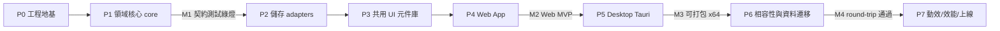

# task.md — Ophan 任務清單（全新設計）

> 本文件對應 `doc/plan.md` 的階段 **P0–P7**，將每階段拆成可在 **半天～一天** 內完成的任務卡。
> 每張任務卡含：**狀態 / 相依 / 產出檔案 / 驗證指令 / commit 訊息**（Conventional Commit + 繁中）。
> 所有任務狀態目前皆為 **`待辦`**。可追溯到 `doc/spec.md` 的驗收條件（標註 `↪ spec`）。
> 事實性數值（版本、色碼、型別、欄位）以 `packages/core/src/index.ts` 與 `apps/web/src/app.css` 為準。

---

## 給不熟者：本文件怎麼用

- **任務卡（Task Card）**：一個可獨立完成、可驗證、可單獨 commit 的工作單位。先看「相依」確認前置完成，再做。
- **里程碑（Milestone）**：一組任務完成後的可驗收檢查點。本專案有四個：
  - **M1** — `packages/core` 契約測試綠燈（領域核心穩定）。
  - **M2** — Web MVP 可用（`apps/web` 跑得起來、CRUD 完整）。
  - **M3** — Desktop 可打包 x64（`apps/desktop` Tauri 2 產出安裝檔）。
  - **M4** — 相容性 round-trip 通過（legacy / 新版 JSON 匯入匯出無損）。
- **狀態圖例**：`待辦` ▸ `進行中` ▸ `審核中` ▸ `完成`。本檔初始全為 `待辦`。
- **Conventional Commit**：`type(scope): 描述`。常用 type：`feat`／`fix`／`refactor`／`docs`／`test`／`chore`／`build`／`perf`。

---

## 里程碑總覽（與 plan P0–P7 對齊）

| 階段 | 主題 | 關鍵里程碑 |
|---|---|---|
| P0 | Monorepo 工程地基 | — |
| P1 | `packages/core` 領域核心 | **M1**（P1-5 完成） |
| P2 | `packages/storage` adapters | — |
| P3 | `packages/ui` 共用元件庫 + design tokens | — |
| P4 | `apps/web`（IndexedDB） | **M2**（P4-7 完成） |
| P5 | `apps/desktop`（Tauri 2 + SQLite） | **M3**（P5-6 完成） |
| P6 | 相容性與資料遷移 | **M4**（P6-4 完成） |
| P7 | 動效 / 效能 / 品質 / 上線 | — |

---

# P0 — Monorepo 工程地基

### P0-1　建立 npm workspaces 骨架
- **狀態**：待辦
- **相依**：—
- **產出檔案**：`package.json`（root，`workspaces: ["apps/*","packages/*"]`）、`packages/core/package.json`、`packages/storage/package.json`、`packages/ui/package.json`、`apps/web/package.json`、`apps/desktop/package.json`、`.gitignore`
- **內容**：建立五個 workspace 與 root scripts（`dev`/`build`/`check`/`test`）。所有相依鎖最新且 x64。
- **驗證**：`npm install && npm ls --workspaces`
- **commit**：`chore(repo): 建立 npm workspaces monorepo 骨架`

### P0-2　TypeScript 6.0.3 專案參考與 base config
- **狀態**：待辦
- **相依**：P0-1
- **產出檔案**：`tsconfig.base.json`、各 workspace `tsconfig.json`（`composite: true`、project references）
- **內容**：`typescript@6.0.3`。`strict: true`、`moduleResolution: "bundler"`、`target: "ES2023"`。core 設 `lib: ["ES2023"]`（**不含 DOM**）以強制 browser-neutral。
- **驗證**：`npx tsc -b --dry`
- **commit**：`chore(repo): 設定 TypeScript 6 project references 與嚴格模式`

### P0-3　Lint / Format 工具鏈
- **狀態**：待辦
- **相依**：P0-1
- **產出檔案**：`eslint.config.js`（flat config）、`.prettierrc`、`.editorconfig`
- **內容**：`eslint@10.5.0`、`typescript-eslint@8.61.1`、`prettier@3.8.4`。2-space 縮排；`camelCase`/`PascalCase`/`kebab-case` 慣例。
- **驗證**：`npx eslint . && npx prettier --check .`
- **commit**：`chore(repo): 導入 ESLint 10 與 Prettier 3 工具鏈`

### P0-4　測試框架與 CI 腳本
- **狀態**：待辦
- **相依**：P0-2
- **產出檔案**：`vitest.config.ts`（root）、`.github/workflows/ci.yml`、root `package.json` 之 `test`/`test:core` script
- **內容**：`vitest@4.1.9`、`@playwright/test@1.61.0`（暫只裝，P4 才用）。CI 跑 `check` + `test`，runner 為 x64。
- **給不熟者**：Vitest 是 Vite 原生的測試框架，API 近似 Jest。官方文件：https://vitest.dev/guide/
- **驗證**：`npx vitest run --passWithNoTests`
- **commit**：`ci(repo): 加入 Vitest 與 GitHub Actions 檢查流程`

---

# P1 — `packages/core` 領域核心（純 TS，零框架依賴）

> 來源真相：`packages/core/src/index.ts`。core **不得** import DOM / IndexedDB / SQLite / Svelte / Tauri。

### P1-1　Entity 型別與列舉
- **狀態**：待辦
- **相依**：P0-2
- **產出檔案**：`packages/core/src/types.ts`（或 `index.ts`）
- **內容**：定義 `Project`、`Idea`、`WorkspaceData`（`schemaVersion: 1`）、`ProjectRepository`（port）、`ProjectStats`、`CompletionLogEntry`。
  - 列舉：`ProjectCategory = "CI"|"MP"|"SP"|null`；`IdeaFilter = "todo"|"done"|"all"`；`ProjectCategoryFilter = "CI"|"MP"|"SP"|"NA"`（`NA` 代表 `null` 未分類）；`Theme = "light"|"dark"`；`Locale = "en"|"zh-TW"`。
  - `WorkspaceData.meta = { appName: "ophan", updatedAt, deviceId }`；`ideas` 為**扁平**陣列（非巢狀），以 `projectId` 關聯。
  - 欄位預設：Project `name="Untitled project"`、`description=""`、`category=null`、`pinned=false`；Idea `text="Untitled idea"`、`done=false`、`pinned=false`。
- **驗證**：`npm run check -w @ophan/core`
- **commit**：`feat(core): 定義 WorkspaceData 領域型別與列舉`

### P1-2　ID / 時間戳 / 工具函式
- **狀態**：待辦
- **相依**：P1-1
- **產出檔案**：`packages/core/src/index.ts`
- **內容**：`createId()`（`crypto.randomUUID()`，否則 fallback `id_${Date.now()}_${random16}`）、`nowIso()`（`new Date().toISOString()`，ISO 8601）、`toIsoTimestamp()`（毫秒 number / 字串 → ISO，無效回 fallback）、`normalizeCategory()`、`createEmptyWorkspace()`、`touchWorkspace()`。日期欄位格式為 `YYYY-MM-DD`。
- **驗證**：`npm run check -w @ophan/core`
- **commit**：`feat(core): 加入 ID 生成與 ISO 8601 時間戳工具`

### P1-3　查詢 / 排序 / 統計 selector
- **狀態**：待辦
- **相依**：P1-2
- **產出檔案**：`packages/core/src/index.ts`
- **內容**：`sortWorkItems()`（**排序語意：pinned 優先 → order 升冪 → updatedAt `localeCompare`**）、`getVisibleProjects()`（過濾 `deletedAt`）、`getIdeasForProject()`、`getFilteredIdeas()`（todo/done/all）、`getProjectStats()`（`percent = round(done/total*100)`，total=0 時 0）、`getCompletionLog()`（done 且有 `finishedAt`，依 `finishedAt` 倒序）。
- **驗證**：`npm run check -w @ophan/core`
- **commit**：`feat(core): 加入專案/idea 查詢、排序與統計 selector`

### P1-4　UseCase（CRUD / pin / done / reorder）
- **狀態**：待辦
- **相依**：P1-3
- **產出檔案**：`packages/core/src/index.ts`
- **內容**：純函式 use-case，皆回傳新 `WorkspaceData` 並 `touchWorkspace`：
  - Project：`createProject`（`order=` 尾端）、`updateProject`、`deleteProject`（軟刪除：`deletedAt`，連動其 ideas）、`toggleProjectPin`、`moveProject(±1)`、`moveProjectTo(targetId)`。
  - Idea：`createIdea`、`updateIdea`、`deleteIdea`（軟刪除）、`toggleIdeaDone`（**done false→true 設 `finishedAt=now`；true→false 設回 `null`**）、`toggleIdeaPin`、`moveIdea(±1)`、`moveIdeaTo(targetId)`。
  - reorder helper 寫回連續 `order` 並只更新受影響項目的 `updatedAt`。
- **驗證**：`npm run check -w @ophan/core`
- **commit**：`feat(core): 實作專案與 idea 的 use-case 純函式`

### P1-5　匯入正規化 / 匯出（normalize round-trip）　— M1 收尾
- **狀態**：待辦
- **相依**：P1-4
- **產出檔案**：`packages/core/src/index.ts`、`packages/core/src/__tests__/contract.test.ts`
- **內容**：`normalizeWorkspace()`（自動偵測 array / nested-legacy object / 新版）、`importLegacyProjects()`（巢狀 ideas 攤平為扁平 + `projectId`）、`importWorkspaceJson()`、`exportWorkspaceJson()`（2-space 縮排）。回填：`updatedAt`、`deletedAt: null`、`order`（依索引）、`createdAt`（毫秒→ISO）。
  - **契約測試（M1 條件）**：排序語意、`finishedAt` 轉移、軟刪除過濾、`getProjectStats.percent`、legacy array 匯入、nested→flat 攤平、`normalize ∘ export` 冪等。
- **驗證**：`npm run check -w @ophan/core && npx vitest run packages/core`
- **commit**：`test(core): 補齊領域核心契約測試達成 M1`

> **[里程碑 M1] core 契約測試綠燈**：P1-1～P1-5 完成，`vitest run packages/core` 全綠。`↪ spec`（資料格式 / 相容要求）

---

# P2 — `packages/storage` 儲存 adapters（實作 `ProjectRepository` port）

> port 在 core，adapter 在此。Web 與 Desktop **只替換 adapter**，領域核心與 UI 不變。

### P2-1　IndexedDbRepository（Web adapter）
- **狀態**：待辦
- **相依**：M1
- **產出檔案**：`packages/storage/src/indexed-db.ts`
- **內容**：DB `name="ophan"`、object store `"workspace"`、key `"current"`，值為序列化 `WorkspaceData`。實作 `loadWorkspace`/`saveWorkspace`/`exportWorkspace`/`importWorkspace`。load 時若空則 `createEmptyWorkspace()`。
- **給不熟者**：IndexedDB 是瀏覽器內建的鍵值/物件資料庫。MDN：https://developer.mozilla.org/docs/Web/API/IndexedDB_API
- **驗證**：`npm run check -w @ophan/storage`
- **commit**：`feat(storage): 實作 IndexedDB 儲存 adapter`

### P2-2　LegacyImporter（舊資料來源偵測）
- **狀態**：待辦
- **相依**：P2-1
- **產出檔案**：`packages/storage/src/legacy-importer.ts`
- **內容**：讀 legacy LocalStorage `key="project-idea-collection.v1"`；支援壓縮前綴 `"lz:"`（`lz-string@1.5.0` `decompressFromUTF16`）；讀 legacy 主題/UI key `project-idea-collection.theme` / `project-idea-collection.ui`。產出交給 core `normalizeWorkspace()`。
  - legacy 格式：`Project={id,name,description,startDate,dueDate,category,pinned,ideas:[…]}`（巢狀）；`Idea={id,text,done,createdAt(毫秒 number),finishedAt,pinned}`。
- **驗證**：`npm run check -w @ophan/storage`
- **commit**：`feat(storage): 加入 legacy LocalStorage 匯入器（含 lz-string 解壓）`

### P2-3　SqliteRepository（Desktop adapter，與 P5 對接）
- **狀態**：待辦
- **相依**：P2-1
- **產出檔案**：`packages/storage/src/sqlite.ts`、`packages/storage/src/sqlite-schema.sql`
- **內容**：以 `@tauri-apps/plugin-sql@2.4.0` 連 SQLite。三表 `projects` / `ideas` / `meta`，需能 **1:1 round-trip 回 `WorkspaceData` JSON**。`projects.category` 存 `"CI"|"MP"|"SP"|NULL`；`ideas.done`/`pinned` 以 `INTEGER 0/1`；時間欄位存 ISO 8601 字串。
- **給不熟者**：`@tauri-apps/plugin-sql` 讓前端 TS 直接對 SQLite 下 SQL，邏輯仍留前端。文件：https://v2.tauri.app/plugin/sql/
- **驗證**：`npm run check -w @ophan/storage`
- **commit**：`feat(storage): 設計可 round-trip 的 SQLite 三表 schema 與 adapter`

### P2-4　Storage 契約測試（adapter 一致性）
- **狀態**：待辦
- **相依**：P2-1, P2-2, P2-3
- **產出檔案**：`packages/storage/src/__tests__/repository.contract.test.ts`
- **內容**：以同一組契約測試套用至各 adapter（save→load 等價、export→import 等價）。IndexedDB 用 `fake-indexeddb` 模擬，SQLite 用 in-memory。
- **驗證**：`npx vitest run packages/storage`
- **commit**：`test(storage): 加入 Repository adapter 一致性契約測試`

---

# P3 — `packages/ui` 共用 Svelte 5 元件庫 + design tokens

> Web 與 Desktop **共用同一份 UI**。元件不直接碰 storage，只透過 props / callback。

### P3-1　Design tokens（色票 / 字體 / 間距）
- **狀態**：待辦
- **相依**：P0-1
- **產出檔案**：`packages/ui/src/styles/tokens.css`
- **內容**：以 `apps/web/src/app.css` 為事實來源建立 token：
  - **Light**：`--bg:#f6f6f1`、`--bg-soft:#f9efe4`、`--surface:#ffffff`、`--surface-2:#f1f4f0`、`--ink:#0d1b2a`、`--muted:#5b6473`、`--accent:#1f8a70`、`--accent-ink:#176b56`、`--accent-2:#e9b44c`、`--accent-2-ink:#705018`、`--danger:#d1495b`、`--border:rgba(13,27,42,0.1)`、`--border-strong:rgba(13,27,42,0.18)`、`--shadow-pop:0 8px 24px rgba(13,27,42,0.12)`。
  - **Dark**（`:root[data-theme="dark"]`）：`--bg:#0b1116`、`--bg-soft:#141f28`、`--surface:#161f27`、`--surface-2:#1b2630`、`--ink:#f4f6f9`、`--muted:#b1bcc7`、`--accent:#33c1a0`、`--accent-ink:#66dfc4`、`--accent-2:#f0c56d`、`--danger:#e06c7c`、shadow `0 8px 24px rgba(4,8,12,0.5)`。
  - 漸層 `--grad-accent: linear-gradient(90deg, var(--accent), var(--accent-2))`、`--grad-border` 雙色描邊；大量 `color-mix(in srgb, …)`。
  - 字體 `--font-ui: "Chiron GoRound TC","Noto Sans TC","Microsoft JhengHei",sans-serif`（display/mono 同 ui）。
- **驗證**：`npm run check -w @ophan/ui`
- **commit**：`feat(ui): 建立 design tokens 色票與字體變數`

### P3-2　排版 / 圓角 / 焦點環基礎樣式
- **狀態**：待辦
- **相依**：P3-1
- **產出檔案**：`packages/ui/src/styles/base.css`
- **內容**：字級 — 標題 `clamp(20px,2.4vw,27px)/lh1.1`、hero `clamp(32px,5vw,58px)`、dialog 標題 `21px`、brand `18px`、正文 `14px/lh1.65`、panel/idea `13.5px w600`、小字 `12.5/12/11.5/11/10.5/10/9.5px`。圓角 pill `999px` 及 `18/16/14/12/10/9/8/6px`。focus-visible `outline 2px var(--accent) offset2`；focus ring `box-shadow 0 0 0 3px color-mix(accent 18% transparent)`。
- **驗證**：`npm run check -w @ophan/ui`
- **commit**：`feat(ui): 加入排版、圓角與焦點環基礎樣式`

### P3-3　icon 系統與 Skeleton shimmer
- **狀態**：待辦
- **相依**：P3-2
- **產出檔案**：`packages/ui/src/Icon.svelte`、`packages/ui/src/Skeleton.svelte`
- **內容**：`@lucide/svelte@1.18.0`，尺寸 `13/16/18/19px`、`strokeWidth 2.4`、`fill none`，**嚴禁 emoji**。Skeleton：底色 `--surface-2`，`shimmer @keyframes { to { transform: translateX(100%) } } 1.4s infinite`，`.line min-height14 radius6`，提供**多種樣式**（line / card / chart / avatar 變體）。
- **給不熟者（Svelte runes）**：Svelte 5 用 `$state`/`$derived`/`$effect` 與 `onclick`，不混用舊 `$:`/`on:`。官方教學：https://svelte.dev/docs/svelte/what-are-runes
- **驗證**：`npm run check -w @ophan/ui`
- **commit**：`feat(ui): 加入 lucide Icon 與多樣式 Skeleton shimmer`

### P3-4　基礎互動元件（Topbar / Dialog / Toast）
- **狀態**：待辦
- **相依**：P3-3
- **產出檔案**：`packages/ui/src/Topbar.svelte`、`packages/ui/src/Dialog.svelte`、`packages/ui/src/Toast.svelte`、`packages/ui/src/ConfirmDialog.svelte`
- **內容**：Topbar（`backdrop-filter blur14`、`--note` 毛玻璃底、`12px` 圓角、`padding 9px 14px`、左 brand 右 actions）；Dialog（native `<dialog>`、`min(540px,100vw-40px)`、`16px` 圓角、backdrop `rgba(13,27,42,0.4) blur3`）；Toast（`fixed right16 bottom16 z-index30`、`--ink` 反底、`11px` 圓角）。
- **驗證**：`npm run check -w @ophan/ui`
- **commit**：`feat(ui): 加入 Topbar、Dialog 與 Toast 元件`

### P3-5　工作區元件（ProjectRail / IdeaPanel）
- **狀態**：待辦
- **相依**：P3-4
- **產出檔案**：`packages/ui/src/ProjectRail.svelte`、`packages/ui/src/IdeaPanel.svelte`、`packages/ui/src/ProjectDialog.svelte`
- **內容**：ProjectRail（`314px`、可收合、頂部計數 + 篩選 chips `CI/MP/SP/NA`、卡片 HTML5 DnD `draggable`、`animate:flip`+fade、active 綠邊、dragging `opacity 0.45`）。IdeaPanel（eyebrow + 進度條 + 標題 + `todo/done/all` tabs、輸入列、idea 卡含 check 圓 / 文字 / 時間戳 / hover 顯示 pin·edit·del·上下移；done 態 `opacity 0.62` + line-through）。
- **驗證**：`npm run check -w @ophan/ui`
- **commit**：`feat(ui): 加入 ProjectRail 與 IdeaPanel 工作區元件`

### P3-6　完成面板與趨勢圖（CompletionPanel / TrendChart）
- **狀態**：待辦
- **相依**：P3-5
- **產出檔案**：`packages/ui/src/CompletionPanel.svelte`、`packages/ui/src/TrendChart.svelte`、`packages/ui/src/echarts-lite.ts`
- **內容**：CompletionPanel（log 列表 `animate:flip`+slide、hover 顯示 reopen）。TrendChart：`echarts@6.1.0` line smooth，**動態 `import()` code-split（約 509KB 獨立 chunk）**，僅首次展開載入，`$effect` 讀 CSS 變數做主題同步，**14 天 bucket 聚合**。
- **給不熟者**：`$effect` 在依賴變動時重跑，用來把 ECharts 主題與 CSS 變數同步。文件：https://svelte.dev/docs/svelte/$effect
- **驗證**：`npm run check -w @ophan/ui`
- **commit**：`feat(ui): 加入 CompletionPanel 與延遲載入的 ECharts TrendChart`

---

# P4 — `apps/web`（Svelte 5 + Vite，IndexedDB adapter）

### P4-1　Vite + Svelte 專案啟動
- **狀態**：待辦
- **相依**：P3-1
- **產出檔案**：`apps/web/vite.config.ts`、`apps/web/index.html`、`apps/web/src/main.ts`、`apps/web/src/App.svelte`、`apps/web/src/app.css`
- **內容**：`vite@8.0.16`、`@sveltejs/vite-plugin-svelte@7.1.2`、`svelte@5.56.3`、`svelte-check@4.6.0`。dev server 固定埠（避免占用 5173 衝突）。`app.css` import `@ophan/ui` tokens。
- **給不熟者**：Vite 是 dev server / 打包器。Svelte 入門：https://svelte.dev/docs/svelte/getting-started
- **驗證**：`npm run check -w @ophan/web && npm run build -w @ophan/web`
- **commit**：`feat(web): 建立 Vite + Svelte 5 應用骨架`

### P4-2　State runes 模組（app / ui / dialogs）
- **狀態**：待辦
- **相依**：P4-1, M1
- **產出檔案**：`apps/web/src/lib/state/app.svelte.ts`、`ui.svelte.ts`、`dialogs.svelte.ts`
- **內容**：`app.svelte.ts` 持有 `WorkspaceData` 並包 core use-case + `persist()`（呼叫 IndexedDbRepository）。`ui.svelte.ts` 管 theme / 收合 / category filter，持久化到 `ophan.ui`，結構 `{ railCollapsed:false, logCollapsed:true, categoryFilters:[] }`。`dialogs.svelte.ts` 管 dialog 開關。
- **驗證**：`npm run check -w @ophan/web`
- **commit**：`feat(web): 建立 app/ui/dialogs runes 狀態模組`

### P4-3　組裝三欄工作區版面
- **狀態**：待辦
- **相依**：P4-2, P3-5, P3-6
- **產出檔案**：`apps/web/src/App.svelte`
- **內容**：app-shell `grid-template-rows: auto minmax(0,1fr)`、`height 100dvh`、`padding 14px`、`body overflow hidden`（無外層捲動）。workspace `grid-template-columns: var(--rail-w) minmax(0,1fr) var(--log-w)`；`--rail-w 314px`、`--log-w 354px`，收合設 `0px`，`transition 0.28s cubic-bezier(0.4,0,0.2,1)`。右欄預設收合，各欄獨立捲動。
- **驗證**：`npm run check -w @ophan/web && npm run build -w @ophan/web`　`↪ spec`（版面無外層捲動）
- **commit**：`feat(web): 組裝 100dvh app-shell 三欄工作區`

### P4-4　專案 CRUD / pin / 排序串接
- **狀態**：待辦
- **相依**：P4-3
- **產出檔案**：`apps/web/src/App.svelte`、`apps/web/src/lib/state/app.svelte.ts`
- **內容**：建立 / 編輯 / 刪除 project；pin/unpin；HTML5 DnD `moveProjectTo`；category chips（`all/CI/MP/SP/NA`）過濾，篩選持久化於 `ophan.ui`。
- **驗證**：`npm run check -w @ophan/web`　`↪ spec`（CRUD project / pin / 排序）
- **commit**：`feat(web): 串接專案 CRUD、pin 與拖曳排序`

### P4-5　Idea CRUD / done / 進度 / log 串接
- **狀態**：待辦
- **相依**：P4-4
- **產出檔案**：`apps/web/src/App.svelte`
- **內容**：idea 建立 / 編輯 / 刪除 / pin；`todo/done/all` 切換；`toggleIdeaDone` 更新進度條與 completion log（reopen）；上下移與 DnD `moveIdeaTo`。
- **驗證**：`npm run check -w @ophan/web`　`↪ spec`（CRUD idea / done / 進度 / log）
- **commit**：`feat(web): 串接 idea CRUD、完成切換與完成紀錄`

### P4-6　匯入 / 匯出 / legacy 遷移入口
- **狀態**：待辦
- **相依**：P4-5, P2-2
- **產出檔案**：`apps/web/src/App.svelte`、`apps/web/src/lib/state/app.svelte.ts`
- **內容**：匯出 Ophan JSON（`exportWorkspaceJson`）；匯入 Ophan / legacy JSON（`importWorkspaceJson`）；偵測到 legacy LocalStorage 時顯示遷移 CTA。新版 keys：`ophan.device-id`、`ophan.theme`、`ophan.ui`、`ophan.locale`。
- **驗證**：`npm run check -w @ophan/web`　`↪ spec`（匯出 / 匯入 / legacy CTA）
- **commit**：`feat(web): 加入 JSON 匯入匯出與 legacy 遷移入口`

### P4-7　主題切換 + Playwright 煙霧測試　— M2 收尾
- **狀態**：待辦
- **相依**：P4-6
- **產出檔案**：`apps/web/src/lib/state/ui.svelte.ts`、`apps/web/tests/smoke.spec.ts`、`apps/web/playwright.config.ts`
- **內容**：light/dark 切換（`data-theme`，持久化 `ophan.theme`）。`@playwright/test@1.61.0` 煙霧測試涵蓋：建專案→加 idea→完成→看趨勢圖→切主題→reload 保留狀態。
- **驗證**：`npm run check && npm run build && npx playwright test`
- **commit**：`test(web): 加入主題切換與 Playwright 煙霧測試達成 M2`

> **[里程碑 M2] Web MVP 可用**：P4-1～P4-7 完成，`npm run build` 通過、Playwright 全綠。`↪ spec`（全部使用者需求 + 驗收條件）

---

# P5 — `apps/desktop`（Tauri 2 殼，SQLite adapter）

> Rust **最小化**：業務邏輯留前端 TS，Rust 僅殼層設定與必要原生橋接。載入**同一份 `packages/ui`**，只換成 `SqliteRepository`。

### P5-1　Tauri 2 殼初始化（x64）
- **狀態**：待辦
- **相依**：M2
- **產出檔案**：`apps/desktop/src-tauri/Cargo.toml`、`apps/desktop/src-tauri/tauri.conf.json`、`apps/desktop/src-tauri/src/main.rs`、`apps/desktop/package.json`
- **內容**：`@tauri-apps/cli@2.11.2`、`@tauri-apps/api@2.11.0`。`tauri.conf.json` 指向 web build；target `x86_64-pc-windows-msvc`。`main.rs` 只做 `tauri::Builder::default().run()`。
- **給不熟者（Rust/Tauri）**：Tauri 用 Rust 殼包前端，產生原生視窗與安裝檔。前端不必懂 Rust。文件：https://v2.tauri.app/start/
- **驗證**：`npm run tauri info -w @ophan/desktop`
- **commit**：`feat(desktop): 初始化 Tauri 2 桌面殼（x64）`

### P5-2　共用 UI 載入（複用 packages/ui）
- **狀態**：待辦
- **相依**：P5-1, P3-6
- **產出檔案**：`apps/desktop/src/main.ts`、`apps/desktop/src/App.svelte`、`apps/desktop/vite.config.ts`
- **內容**：以與 web 相同的 `packages/ui` 元件組裝畫面；差異僅在注入的 repository。確保 design tokens 與動效一致。
- **驗證**：`npm run check -w @ophan/desktop && npm run build -w @ophan/desktop`
- **commit**：`feat(desktop): 載入共用 UI 元件庫組裝桌面畫面`

### P5-3　SQLite plugin 接線
- **狀態**：待辦
- **相依**：P5-2, P2-3
- **產出檔案**：`apps/desktop/src-tauri/tauri.conf.json`（plugin 設定）、`apps/desktop/src/lib/repository.ts`
- **內容**：啟用 `@tauri-apps/plugin-sql@2.4.0`，DB 檔案存於 app data dir；首次啟動執行 `sqlite-schema.sql` 建表（projects/ideas/meta）。注入 `SqliteRepository`。
- **驗證**：`npm run check -w @ophan/desktop`
- **commit**：`feat(desktop): 接上 SQLite plugin 與資料庫初始化`

### P5-4　原生設定持久化（plugin-store）
- **狀態**：待辦
- **相依**：P5-3
- **產出檔案**：`apps/desktop/src/lib/settings.ts`
- **內容**：`@tauri-apps/plugin-store@2.4.3` 存桌面端的 theme / locale / UI 收合狀態（對應 web 的 `ophan.theme`/`ophan.locale`/`ophan.ui`）。
- **驗證**：`npm run check -w @ophan/desktop`
- **commit**：`feat(desktop): 以 plugin-store 持久化桌面設定`

### P5-5　桌面端遷移：匯入 web/legacy JSON
- **狀態**：待辦
- **相依**：P5-3
- **產出檔案**：`apps/desktop/src/App.svelte`
- **內容**：提供「匯入 JSON 檔」入口，經 core `importWorkspaceJson()` 正規化後寫入 SQLite，讓 web 使用者可遷移到桌面版。
- **驗證**：`npm run check -w @ophan/desktop`
- **commit**：`feat(desktop): 加入桌面端 JSON 匯入遷移`

### P5-6　打包 x64 安裝檔　— M3 收尾
- **狀態**：待辦
- **相依**：P5-4, P5-5
- **產出檔案**：`apps/desktop/src-tauri/tauri.conf.json`（bundle 設定）、CI release job
- **內容**：`tauri build --target x86_64-pc-windows-msvc` 產出 `.msi`/`.exe`。版本資訊與 app 名稱。
- **驗證**：`npm run tauri build -w @ophan/desktop`（產出 x64 安裝檔）
- **commit**：`build(desktop): 打包 Windows x64 安裝檔達成 M3`

> **[里程碑 M3] Desktop 可打包 x64**：P5-1～P5-6 完成，`tauri build` 產出可安裝的 x64 包。

---

# P6 — 相容性與資料遷移（round-trip 硬地基）

> 資料相容是硬約束：必須能匯入現有 `WorkspaceData`（`schemaVersion:1`）與所有 legacy 格式。

### P6-1　legacy array JSON 匯入測試
- **狀態**：待辦
- **相依**：M1, P2-2
- **產出檔案**：`packages/storage/src/__tests__/legacy-array.test.ts`、`packages/storage/src/__tests__/fixtures/legacy-array.json`
- **內容**：以真實 legacy 匯出檔（array-based，巢狀 ideas）驗證 `normalizeWorkspace`：巢狀 ideas 攤平 + `projectId`、`createdAt` 毫秒→ISO、`order` 依索引回填、`category` 正規化。
- **驗證**：`npx vitest run packages/storage`　`↪ spec`（相容要求）
- **commit**：`test(storage): 驗證 legacy array JSON 匯入正規化`

### P6-2　legacy LocalStorage（含 lz:）匯入測試
- **狀態**：待辦
- **相依**：P6-1
- **產出檔案**：`packages/storage/src/__tests__/legacy-localstorage.test.ts`
- **內容**：驗證 `project-idea-collection.v1`（含 `lz:` 壓縮）解析；legacy `project-idea-collection.theme` / `.ui` 對映到新版設定。
- **驗證**：`npx vitest run packages/storage`
- **commit**：`test(storage): 驗證 legacy LocalStorage 與 lz 壓縮匯入`

### P6-3　SQLite ↔ WorkspaceData round-trip 測試
- **狀態**：待辦
- **相依**：P2-3
- **產出檔案**：`packages/storage/src/__tests__/sqlite-roundtrip.test.ts`
- **內容**：`WorkspaceData → SQLite 三表 → 讀回 → WorkspaceData` 等價（含 `category=null`、`deletedAt`、`finishedAt`、`pinned`、`order` 全保留）。
- **驗證**：`npx vitest run packages/storage`
- **commit**：`test(storage): 驗證 SQLite 三表與 WorkspaceData 無損 round-trip`

### P6-4　跨格式相容矩陣（legacy → web → desktop）　— M4 收尾
- **狀態**：待辦
- **相依**：P6-1, P6-2, P6-3
- **產出檔案**：`packages/storage/src/__tests__/compat-matrix.test.ts`
- **內容**：端到端：legacy JSON → core normalize → IndexedDB save/load → export → SQLite import → export，全程資料等價。覆蓋空白、未分類（`NA`/null）、軟刪除、pinned 浮頂等邊界。
- **驗證**：`npm run check && npx vitest run packages/storage`
- **commit**：`test(storage): 完成跨格式相容矩陣測試達成 M4`

> **[里程碑 M4] 相容性 round-trip 通過**：P6-1～P6-4 全綠，legacy / web / desktop 三方資料無損互通。`↪ spec`（相容要求 / 驗收條件）

---

# P7 — 動效 / 效能 / 品質 / 上線

### P7-1　GSAP 進場動畫
- **狀態**：待辦
- **相依**：M2
- **產出檔案**：`packages/ui/src/lib/motion.ts`、各元件
- **內容**：`gsap@3.15.0` 一次性進場 timeline `duration 0.45 ease power2.out`；bars `y:-12 stagger0.05`、panels `y:16 stagger0.08`、cards `y:10 stagger0.04`。
- **給不熟者**：GSAP 是動畫函式庫，這裡只做一次性進場，不接管狀態。文件：https://gsap.com/docs/v3/
- **驗證**：`npm run build -w @ophan/web`
- **commit**：`feat(ui): 加入 GSAP 一次性進場 stagger 動畫`

### P7-2　Svelte 過場與進度動效
- **狀態**：待辦
- **相依**：P7-1
- **產出檔案**：各 `packages/ui` 元件
- **內容**：`animate:flip motionMs(240)`、`transition:slide motionMs(160)`、`fade motionMs(140)`；progress `width 0.4s cubic-bezier(0.22,1,0.36,1)`；active `transform translateY(1px) scale(0.98)`。DnD 只在 drop 時 reorder，避免與 FLIP 衝突。
- **驗證**：`npm run check -w @ophan/ui`
- **commit**：`feat(ui): 加入 FLIP 排序與 slide/fade 過場動畫`

### P7-3　reduced-motion 全域總閘 + 響應式斷點
- **狀態**：待辦
- **相依**：P7-2
- **產出檔案**：`packages/ui/src/styles/base.css`
- **內容**：`@media (prefers-reduced-motion)` 下所有動畫降為 `0.01ms`；`shimmer` 停用。斷點 `900px`（平板單欄）、`560px`（手機）；`@media (hover:none)` 下 hover 操作改常駐。
- **驗證**：`npm run build -w @ophan/web`　`↪ spec`（reduced-motion 停用動畫）
- **commit**：`feat(ui): 加入 reduced-motion 總閘與響應式斷點`

### P7-4　延遲載入 / 視差 / code-split 效能
- **狀態**：待辦
- **相依**：P7-1, P3-6
- **產出檔案**：`apps/web/vite.config.ts`、`apps/desktop/vite.config.ts`
- **內容**：ECharts 動態 `import()` 維持獨立 chunk（約 509KB）；圖片 / 重元件延遲載入；可選視差滾動（reduced-motion 下停用）。確認 chart 僅首次展開右欄時載入。
- **驗證**：`npm run build`（檢查 chunk 分割）
- **commit**：`perf(web): 延遲載入趨勢圖並拆分獨立 chunk`

### P7-5　i18n（en / zh-TW）
- **狀態**：待辦
- **相依**：M2
- **產出檔案**：`packages/ui/src/i18n/en.ts`、`packages/ui/src/i18n/zh-TW.ts`、`packages/ui/src/i18n/index.ts`
- **內容**：`Locale = "en"|"zh-TW"`，持久化 `ophan.locale`（桌面端用 plugin-store）。技術名詞與識別字保留原文。
- **驗證**：`npm run check -w @ophan/ui`
- **commit**：`feat(ui): 加入 en / zh-TW 雙語切換`

### P7-6　無障礙與品質總檢
- **狀態**：待辦
- **相依**：P7-3, P7-5
- **產出檔案**：`apps/web/tests/a11y.spec.ts`
- **內容**：鍵盤可達、focus ring、`inert` 隔離收合欄、icon 皆有 accessible label、確認**全站零 emoji**。`eslint`/`prettier`/`svelte-check` 全綠。
- **驗證**：`npm run check && npx eslint . && npx playwright test`　`↪ spec`（UI 無 emoji / lucide 圖示）
- **commit**：`test(web): 補齊無障礙與品質總檢`

### P7-7　README / 技術文件 / 上線檢查
- **狀態**：待辦
- **相依**：P7-6, M3, M4
- **產出檔案**：`README.md`、`doc/` 技術文件、release notes
- **內容**：彙整 spec / plan / task 與「給不熟者」入門段（Svelte runes / Tauri-Rust / SQLite）。上線前確認 M1–M4 全綠、`npm run build` 與 `tauri build` 通過。
- **驗證**：`npm run build && npm run tauri build -w @ophan/desktop`
- **commit**：`docs(repo): 補齊 README 與上線技術文件`

---

## 附錄：里程碑驗收對照

| 里程碑 | 對應任務 | 一鍵驗證 | spec 可追溯 |
|---|---|---|---|
| **M1** core 契約綠燈 | P1-5 | `npx vitest run packages/core` | 資料格式 / 相容要求 |
| **M2** Web MVP 可用 | P4-7 | `npm run build && npx playwright test` | 全部使用者需求 + 驗收條件 |
| **M3** Desktop x64 可打包 | P5-6 | `npm run tauri build -w @ophan/desktop` | 架構保留桌面殼空間 |
| **M4** 相容 round-trip | P6-4 | `npm run check && npx vitest run packages/storage` | legacy / 新版匯入匯出 |

## 附錄：事實來源

- 領域型別 / use-case / 正規化：`packages/core/src/index.ts`
- 色票 / 字體 / 圓角 / 動效：`apps/web/src/app.css`
- legacy 視覺參考（PolyBackground / ThemeService）：`lagcy/`
- 套件版本（2026-06-16，全 x64）：svelte 5.56.3、vite 8.0.16、typescript 6.0.3、@sveltejs/vite-plugin-svelte 7.1.2、echarts 6.1.0、@lucide/svelte 1.18.0、gsap 3.15.0、lz-string 1.5.0、svelte-check 4.6.0、@tauri-apps/api 2.11.0、@tauri-apps/cli 2.11.2、@tauri-apps/plugin-sql 2.4.0、@tauri-apps/plugin-store 2.4.3、vitest 4.1.9、@playwright/test 1.61.0、eslint 10.5.0、prettier 3.8.4、typescript-eslint 8.61.1
